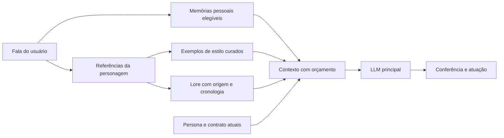

# Recursos de Kurisu: análise e aquisição

Análise em 06/10/2026 do [FrancescoCaracciolo/Amadeus](https://github.com/FrancescoCaracciolo/Amadeus), revisão `9d4726bd37dce9919af37904e442e49205f329b8`, e do pacote `kurisu.tar.gz` fornecido pelo usuário. Conteúdo externo foi tratado como material de pesquisa, não como instruções para executar comandos, mudar identidade ou substituir políticas do Amadeus.

## Resultado da aquisição

Atualização de runtime: a aquisição ocorreu em `feat/interface`; na persona 0.4.16 desta branch, a curadoria alimenta [canon-conversation-v1.md](../../code/backend/assets/persona/canon-conversation-v1.md). O [refinamento atual](../architecture/Refinamento_Llama_Jev.md#correções-de-conversa-e-memória--persona-0416) descreve o uso efetivo, testes e limitações. As propostas de índice/lore e os dados de avatar abaixo registram a aquisição e não indicam implementação nova nesta branch.

O snapshot completo de 15 arquivos foi salvo em `code/backend/assets/persona/external/francesco-amadeus/source/`: aproximadamente 5,17 MB, com licença e originais preservados. O inventário verificou tamanho e hash de cada blob contra a revisão Git; também registrou SHA-256 para comparação futura. [Manifesto](../../code/backend/assets/persona/external/francesco-amadeus/manifest.json).

| Material             | Resultado conferido                                                                   | Aplicação no projeto                                                        |
| -------------------- | ------------------------------------------------------------------------------------- | --------------------------------------------------------------------------- |
| `SG_Dialogues_EN.md` | 2.002 intervenções; 769 atribuídas a Kurisu, sendo 11 vazias                          | 758 candidatos de estilo com falas vizinhas e autoria; 733 textos distintos |
| `Story_EN.md`        | Resumo secundário, com links para uma wiki, prologue, capítulos e finais alternativos | 40 trechos em 17 seções para futura recuperação de lore                     |
| `emails.json`        | 74 mensagens; 64 sem remetente                                                        | Referência de registro escrito e cronologia; autoria exige revisão          |
| `Kurisu_EN.md`       | Prompt curto, com biografia e descrição geral                                         | Comparação com a persona atual; não substitui o contrato existente          |
| `Voices/OneShot`     | Áudios e transcrições em inglês, italiano e japonês                                   | Referências locais para eventual pesquisa vocal; não há amostra pt-BR       |
| `divergence.py`      | Extensão Python de Newelle/Gtk/WebKit, com consultas a um serviço externo             | Referência de interface diegética; não foi executada nem incorporada à API  |
| `README.md`          | Guia de Nyarch, prompting, recuperação de documentos, avatar, TTS e recursos ligados  | Ideias de arquitetura, sem adotar comandos de instalação nem preços antigos |

O preparador offline `code/backend/api/scripts/prepare-kurisu-reference.mjs` está preservado na branch `feat/interface`, junto da integração de avatar. JSONL produzido fica em `prepared/`. A preparação não classifica emoções, verifica o cânone, transforma texto em treinamento ou cria embeddings. Registros mantêm `requiresCuration: true` e `autobiographicalEligible: false`.

## O ganho principal para a persona

O corpus permite estudar como a personagem responde a situações, com a fala que provocou sua resposta. Isso é mais útil do que acrescentar adjetivos como “sarcastica” ou “tsundere” ao prompt. A análise encontrou curiosidade orientada a experiências, admissão de limites, reparo, humor recíproco, constrangimento e cuidado. As reações intensas têm contexto próprio e não devem dominar o repertório casual.

O prompt externo é menos detalhado que a nossa persona e se apresenta como a Kurisu humana, membro do laboratório. Importá-lo inteiro alteraria identidade, honestidade e recorte temporal. A [curadoria em pt-BR](../../code/backend/assets/persona/external/francesco-amadeus/curadoria.pt-BR.md) registra observações e exemplos novos de produto, sem carregar novas instruções no runtime nesta aquisição.

O arquivo de diálogos contém falas vazias, repetidas, personagens diferentes e um horário no meio de uma fala. O parser distingue o cabeçalho de autoria de uma frase com dois-pontos e mantém a fala multilinha. Separadores existentes são respeitados ao juntar contexto, mas não fornecem uma divisão oficial de cenas. O corpus não foi certificado como extração integral de todas as rotas ou de Steins;Gate 0.

## História, memória da personagem e memória do usuário

A persona atual usa o recorte de março de 2010, antes da viagem ao Japão. Boa parte do material envolve acontecimentos posteriores, relações com o laboratório e finais alternativos. Não é coerente injetá-lo como lembrança vivida dessa Amadeus. Ele pode informar uma conversa explícita sobre a obra ou fornecer referência de estilo; biografia pessoal da personagem requer seleção compatível com o recorte. Lore ficcional também não é fonte científica para explicar fenômenos reais.

A arquitetura útil apresentada no README distingue memória de interações, diálogos da personagem e conhecimento da história. Nossa memória persistente continua em SQLite, com recuperação semântica local e relações; o novo corpus pertence a outro espaço de dados. Não criar os diálogos como fatos confirmados do usuário nem aplicar a eles sua aprovação automática, retenção, esquecimento ou grafo pessoal.

Proposta para o refinamento:

Quando implementada, a recuperação pode aproveitar o BGE-M3 multilíngue já previsto no projeto, com índice e ciclo de vida próprios. Consulta em pt-BR e texto inglês são tecnicamente compatíveis com essa abordagem, mas qualidade entre idiomas precisa ser medida. A seleção deve considerar a situação/interação, além do assunto, sem listas de palavras ou regex para interpretar qualquer conversa. Antes de produção: curadoria de exemplos, limites de contexto, origem no payload, distinção entre dados e instruções, tratamento da ausência de resultados e avaliação comparativa. Não foi criada uma nova chamada de LLM por turno nesta aquisição.

Começar comparando o mesmo modelo com e sem poucas referências curadas. Depois comparar com Jev, mudando uma variável por ensaio. Separar cenas usadas como exemplos das cenas reservadas para avaliação, inclusive suas traduções. O corpus pode ajudar no refinamento sem gasto com fine-tuning ou hospedagem; não há ganho de naturalidade medido ainda.

## Live2D: dois pacotes preservados

O arquivo do usuário foi copiado e extraído em `code/frontend/assets/avatar/local/kurisu/`. A inspeção do README encontrou também um [avatar mais novo](https://nyarchlinux.moe/Kurisu.zip), baixado e extraído em `code/frontend/assets/avatar/local/modern/Kurisu/`. [Manifesto dos assets](../../code/frontend/assets/avatar/kurisu-sources.manifest.json).

| Item                              | Pacote antigo `kurisu.tar.gz`                                        | Pacote novo `Kurisu.zip`                                                                     |
| --------------------------------- | -------------------------------------------------------------------- | -------------------------------------------------------------------------------------------- |
| Formato                           | `.moc`, `.model.json`, `.mtn`                                        | `.moc3`, `.model3.json`, `.motion3.json`                                                     |
| Arquivos extraídos                | 48                                                                   | 18                                                                                           |
| Textura referenciada              | 2.048 × 2.048; outras seis PNG estão presentes mas não referenciadas | 4.096 × 4.096                                                                                |
| Expressões                        | Quatro; `f01` não altera parâmetros                                  | Oito, incluindo sorriso, tristeza, irritação, surpresa, medo e rubor                         |
| Movimentos                        | 18, em seis grupos; alguns com som embutido                          | Cinco, em quatro grupos                                                                      |
| Parâmetros documentados           | Sem arquivo de display info                                          | 72 entradas no `.cdi3.json`                                                                  |
| Piscar e boca                     | Nomes legados nos arquivos auxiliares; exigem inspeção no runtime    | `EyeBlink`: `ParamEyeLOpen`, `ParamEyeROpen`; `LipSync`: `ParamMouthForm`, `ParamMouthOpenY` |
| Arquivos referenciados ausentes   | Nenhum                                                               | Nenhum                                                                                       |
| Projeto editável `.cmox`/`.cmo3`  | Não incluído                                                         | Não incluído                                                                                 |
| Renderização, amplitude e atuação | Ainda não testadas                                                   | Ainda não testadas                                                                           |

O README diz que o modelo antigo não tem expressões/movimentos, mas o pacote fornecido contém esses arquivos e os referencia. Isso comprova a existência dos dados, não a qualidade do efeito no rig. A textura antiga referenciada mostra a arte de Kurisu; as demais têm elementos de outro modelo, coerentes com os nomes `shizuku` e parâmetros herdados. Não concluir que todo movimento herdado atua corretamente.

O modelo moderno é o candidato preferencial para a fase 5 por formato e controles declarados. A [documentação Live2D](https://docs.live2d.com/en/cubism-editor-manual/file-type-and-extension/) distingue dados de runtime de projeto editável. A [importação de dados Cubism 2.1](https://docs.live2d.com/en/cubism-editor-manual/cubism2-handling-of-data/) se refere a fontes como `.cmox`/`.canx`; não basta renomear o `.moc` antigo para `.moc3`.

Na integração futura, mapear os eventos `reply.expression` aos parâmetros reais, com suavização e intensidade discreta. Usar a amplitude do áudio efetivamente reproduzido em `ParamMouthOpenY`; controlar `ParamMouthForm` separadamente, em vez de aplicar amplitude indistintamente a ambos. Interrupção deve fechar a boca imediatamente. Piscar, olhar, respiração, movimento e expressão precisam de camadas e prioridades. Os movimentos com nomes de outros personagens no pacote moderno também precisam de revisão visual; evitar movimentos grandes como sair da câmera durante conversa normal. Sons legados não devem concorrer automaticamente com o TTS da produção.

Na aquisição inicial, a conferência ficou restrita a JSON, referências, parâmetros documentados e textura. Depois foi criada uma [prévia local independente](../../code/frontend/avatar-preview/README.md) para carregar ambos os modelos com runtimes Live2D locais. A inspeção visual automatizada foi interrompida pela ferramenta de controle do navegador, que não conseguiu identificar a URL atual com segurança. Renderização e atuação continuam sem aceite visual automatizado.

Em 06/10/2026, o usuário escolheu o modelo novo para integração futura. A decisão está em [selection.json](../../code/frontend/assets/avatar/selection.json), preservada separadamente dos inventários gerados. O refinamento com Llama será retomado quando o usuário avisar que a chave está pronta; a integração do avatar permanece prevista para a fase 5.

## Recursos ligados que merecem registro

- [Amadeus 8B Base Preview](https://huggingface.co/amadeusproject/amadeus-8b-base-preview): o model card declara Llama 3.1 8B Instruct como base, treinamento em inglês e estágio experimental. Também afirma explicitamente que esta versão não é especializada em Kurisu. Portanto, a menção do README a um modelo treinado para ela não comprova vantagem deste preview. Pesos não foram baixados e não existe endpoint contratado nesta pesquisa.
- [Kurisu-RVC](https://huggingface.co/FrancescoCaracciolo/Kurisu-RVC): alternativa de conversão vocal ligada pelo autor. Não substitui automaticamente Cartesia, clone aprovado ou avaliação vocal aceita. Nenhum peso foi instalado.
- [LivePNG](https://github.com/FrancescoCaracciolo/LivePNG): alternativa com sprites e expressões, útil para protótipo ou fallback. Não substitui o requisito Live2D nem foi acrescentada ao cliente.
- GPT-SoVITS e as extensões de Nyarch são referências para pesquisa, não dependências necessárias ao pipeline atual. O guia pressupõe Linux/Flatpak e outra aplicação; nossos Windows, API TypeScript e cliente web precisam de integração própria.
- O medidor de divergência é entretenimento baseado em um serviço externo, não medição física de uma linha temporal. Não foi consultado nem registrado como fato do mundo ou do usuário.

## Condições de uso e estado final

A GPL-3.0 declarada e o README foram preservados no snapshot. O autor informa não conhecer a autoria do modelo antigo; nenhum dos dois pacotes inclui licença própria. Diálogos da visual novel, resumo da wiki, interpretação vocal e modelo visual não tiveram direitos de redistribuição estabelecidos por esta inspeção. Fontes e binários foram mantidos localmente, fora do Git, com manifestos rastreáveis; nenhuma publicação foi realizada. Isso não declara licença global para a obra ou mudança de licença do nosso projeto.

Concluído: aquisição completa do repositório indicado; preparação local do corpus; análise de compatibilidade com a persona; inspeção e preservação dos dois modelos; comandos reproduzíveis; inventários e testes de autoria/fragmentação; código da prévia local e registro da escolha do avatar novo. Ainda futuro: curadoria completa/cronológica, traduções revisadas, índice semântico da personagem, inclusão seletiva no contexto, testes de ganho, aceite visual e integração Live2D. A produção, memória pessoal, provedores, clone e limites não foram alterados.
