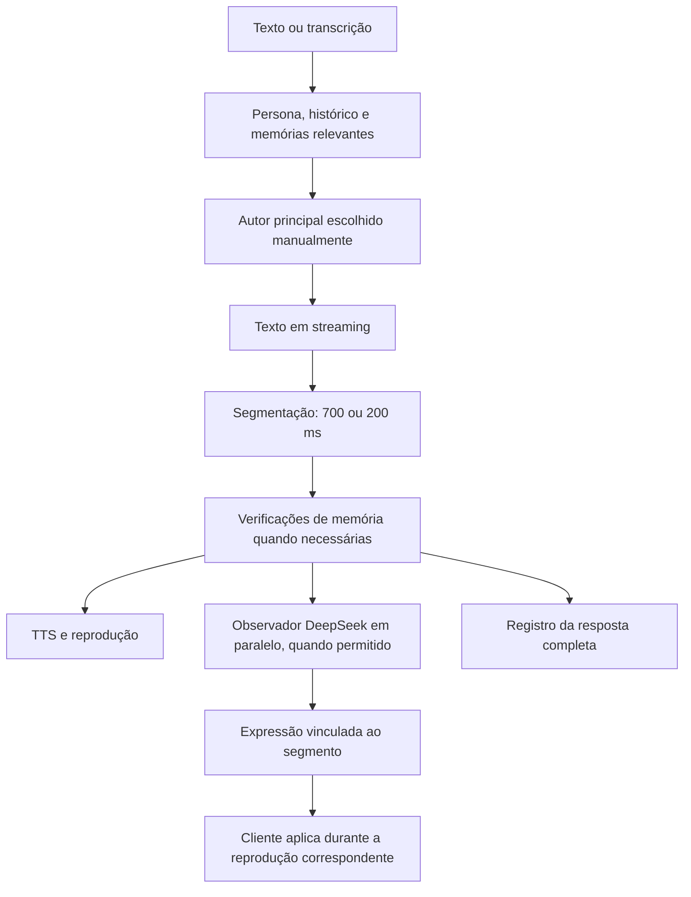

# Integração de fala e expressão no Voice Test

## Estado da integração

O Voice Test permite escolher explicitamente o principal configurado, Llama 3.3 70B ou DeepSeek V4.1 Flash antes de conectar. Isso altera o autor principal; as reservas gratuitas existentes são preservadas. Não há seleção semântica pelo Jev nesta etapa. Essa seleção será uma mudança posterior à validação em voz.

O modo paralelo foi integrado ao processador real de turnos. A API mantém `embedded` como padrão de compatibilidade; a interface oferece `parallel` por padrão e salva a escolha antes de abrir a chamada. O prazo de primeira liberação permanece 700 ms até o operador escolher 200 ms. Não é uma espera fixa somada a toda frase: é o prazo usado pelo segmentador para liberar uma frase completa quando houver texto disponível.

O fluxo mantém a geração e a síntese existentes, incluindo fallback, preset de espera, retomada única após falha elegível, confirmação de áudio realmente ouvido e barge-in. O banco v9 e o seletor experimental não substituem as referências atuais: os resultados não justificaram promovê-los.

## Separação entre fala, memória e expressão

Sem fatos persistentes selecionados, o autor recebe instrução para gerar somente prosa falável. Com fatos selecionados, permanece um cabeçalho mínimo de uso de memória, necessário para a revisão factual existente. Em modo paralelo, emoção, intenção e intensidade deixam de ser exigidas nesse cabeçalho. Portanto, não há remoção do mecanismo de sustentação da memória para ganhar velocidade.

O classificador observa apenas segmentos liberados pela revisão. Um rascunho rejeitado não é sintetizado nem enviado ao observador; a tentativa de recuperação usa o contexto sem os fatos persistentes rejeitados.

O observador usa o prompt revisado de intensidade contínua e o contrato ampliado existente. Recebe o segmento atual, a mensagem atual e até seis mensagens reais anteriores. Não recebe os documentos da persona, o banco completo de memórias nem os exemplos fictícios como histórico. Cada requisição usa JSON, temperatura zero, 160 tokens de saída e o DeepSeek aprovado, sem reservas do autor. Há no máximo duas observações simultâneas por turno; a terceira é omitida enquanto houver duas pendentes. O prazo padrão é 1.500 ms. Não há espera pela classificação antes do TTS nem repetição automática de uma proposta inválida.

`reply.expression` identifica `responseId`, `segmentId` e `position`. A fase `initial` fornece expressão neutra provisória. A fase `update` apresenta a proposta validada do observador para o mesmo segmento. Uma interrupção cancela as observações; um novo turno descarta as anteriores. Respostas fora de ordem não substituem o estado artístico mais recente.

O cliente guarda propostas por segmento e expõe `onExpression` durante a reprodução efetiva do áudio. Uma proposta de um segmento já encerrado não é aplicada ao seguinte. Intervalos entre chunks do mesmo segmento preservam a associação; a interrupção limpa o estado. O Voice Test mostra emoção, intenção e intensidade em um indicador. O avatar Live2D ainda não foi integrado, e `deliveryApplied` continua `false`: esta mudança não configura emoção nativa, pitch ou velocidade do Cartesia.

## Permissões, créditos e configuração

O observador tem consentimento pessoal independente: `observerPersonalConsent` começa em `false`. `local-only` é sempre recusado pelo observador remoto. Para dados pessoais, tanto a opção de consentimento quanto a política `personal-approved` do provedor precisam permitir o processamento. A interface permite autorizar ou retirar o consentimento antes de conectar. A opção é persistida por proprietário no SQLite; ao recarregar a página, o checkbox começa desmarcado e a conexão aplica essa escolha novamente.

A inclusão de envio pessoal contínuo foi inicialmente rejeitada pela revisão automática, pois a autorização anterior abrangia testes textuais. A implementação adotou um bloqueio explícito antes de consultar configuração, reservar cota ou fazer a requisição remota. Nesta integração não foram ativadas configurações pessoais no banco nem executadas chamadas externas.

O observador compartilha a chave OpenRouter do autor configurado. Usa o namespace de contabilização `${ownerId}:expression`, preservando a cota e política configuradas; não cria créditos ou cota remota independente. Não desativa limites de uma configuração gratuita nem ativa pagamento se o acesso pago não existir. Na seleção manual, os máximos de preço por milhão são Llama US$ 0,10/0,32 e DeepSeek US$ 0,14/0,42. O adaptador mantém `data_collection: deny`, raciocínio desativado e as preferências de latência existentes. Esses máximos não garantem disponibilidade de uma rota naquele preço.

Rotas autenticadas:

- `GET /v1/voice/runtime`: revisão e opções atuais.
- `PUT /v1/voice/runtime`: `expectedRevision` e `options`, com modo, prazo, timeout e consentimento. Recusa revisão antiga e mudança durante chamada ativa.
- `POST /v1/voice/runtime/author`: `{ "author": "llama" }` ou `{ "author": "deepseek" }`, selecionando o principal antes de conectar. Não aceita troca durante chamada ativa.

## Validação e roteiro de voz

A integração foi verificada com provedores e PCM simulados. Os testes exercitam reprodução antes dos metadados, expiração, limite de concorrência, descarte após interrupção, bloqueio de dados pessoais/local-only, contabilização independente, proteção HTTP, revisão concorrente e revisão de memória antes de TTS/classificação. Não foram gastos créditos nem usados STT/Cartesia reais nessa verificação.

Para validar manualmente:

1. Reinicie a API (`npm run dev`) e o servidor do Voice Test. Recarregue a página.
2. Selecione Llama, modo paralelo e 700 ms. Autorize o observador pessoal na interface se desejar avaliar expressões com sua fala real.
3. Converse com sequências curtas: saudação; provocação leve → insistência → desculpa; elogio → constrangimento; surpresa → correção; pergunta sobre uma memória confirmada; indicação nova a partir dos gostos.
4. Interrompa uma resposta e mude de assunto. Confirme que o áudio para e que uma expressão atrasada não reaparece na fala seguinte.
5. Encerre a chamada, escolha 200 ms e repita as mesmas falas. Verifique cortes, pausas, prosódia e tempo até o primeiro áudio.
6. Repita com DeepSeek e exporte o relatório. O relatório inclui propostas por segmento e fases, sem texto da conversa ou credenciais.

As medições textuais v9 não comprovam a latência desta integração real: prompt, recuperações, verificação factual e execução concorrente podem alterar o resultado. O observador agora acompanha segmentos posteriores, enquanto a rodada v9 avaliou apenas o primeiro segmento. A fidelidade dessas propostas também precisa de revisão em uso.

Depois dessa validação, a próxima etapa é um roteador pré-geração: escolher um autor pelo contexto, com decisão limitada por tempo e escolha padrão se o Jev demorar ou ficar incerto. Ele ainda não está ativado nem foi tratado como aprovado por estas verificações.
