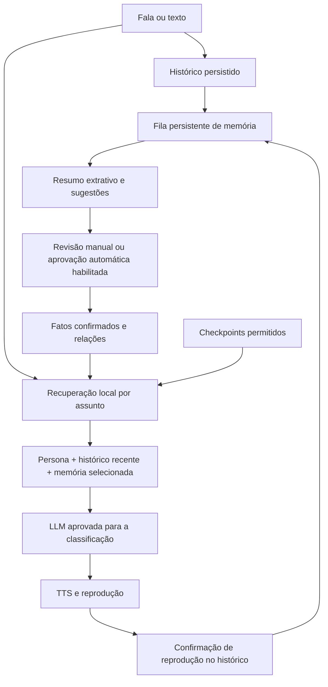

# Fase 3: memória híbrida e retomada

Arquitetura aprovada pelo usuário em 05/10/2026. Implementação: SQLite local, fatos revisáveis, resumos extrativos, grafo leve e recuperação seletiva. LangGraph e banco de grafos separado não são dependências desta fase. Embeddings, treinamento e associações por reforço permanecem posteriores ao escopo atual.

## O que muda na conversa

A API passa a fornecer à LLM fatos confirmados pertinentes ao turno, inclusive fatos de outras conversas. O histórico recente continua limitado e separado. Uma conversa longa também pode recuperar excertos de checkpoints da própria conversa. Guardar dados não altera pesos da LLM e não significa enviar o banco inteiro ao provedor.



A memória integra o pipeline existente, inclusive a recuperação de resposta falável. Voz, clone, STT, presets e personalidade 0.4.13 são preservados. A LLM não recebe ferramentas para alterar a memória durante a geração; confirmação, edição e esquecimento são operações reais da API/CLI. O contexto instrui a personagem a não afirmar que uma alteração aconteceu sem confirmação da API.

## Aprovação automática opcional

Em 05/10/2026, o usuário autorizou uma opção para dispensar a aprovação individual das memórias. `memory_policy.auto_approve` persiste essa escolha por proprietário; a API a expõe como `autoApprove`. A migração `0007_memory_auto_approval` mantém a opção desativada em bancos existentes. A ativação desta instalação foi solicitada pelo usuário.

```powershell
npm run memory -- auto-approve --on
npm run memory -- status
# Retornar à revisão manual das próximas extrações:
npm run memory -- auto-approve --off
```

O comando altera somente a opção, conserva os demais campos e exige a revisão atual da política. `PUT /v1/memory/policy` aceita `autoApprove: true/false`; clientes antigos que omitem o campo conservam a escolha vigente. A mudança cancela extrações em andamento e invalida resultados iniciados na política anterior, permitindo reprocessamento com a opção atual.

Quando ativa, todas as memórias válidas das próximas extrações, locais ou por LLM, passam a `confirmed` sem confirmação por ID. Fatos duradouros, acontecimentos com validade e correções com alvo/versão elegíveis seguem o mesmo fluxo. A aprovação e a substituição ocorrem na transação que salva as evidências. A origem continua `local-extraction`/`llm-extraction`, inclusive nas correções, para que exclusão de fontes e reconstrução preservem a rastreabilidade.

Memórias e checkpoints pessoais/sintéticos recebem `eligible`; a recuperação continua limitada ao assunto, à classificação e à política aprovada de cada provedor. `local-only` conserva a restrição local. A opção mantém a seleção do extrator, as instruções para distinguir hipóteses/ficção e as validações de schema/citações; cada fala não vira automaticamente um fato. Habilitação pessoal, retenção, cotas, expiração, esquecimento e bloqueios de fontes continuam aplicados.

Ligar a opção não promove retrospectivamente todas as sugestões existentes. Uma sugestão derivada pode ser aprovada se reencontrada em nova extração validada; permissões de fatos já revisados manualmente são preservadas. Desligar volta à revisão manual das novas extrações, sem revogar as aprovações anteriores. `review`, `edit` e `forget` continuam disponíveis para corrigir ou remover memórias.

Verificação desta alteração: 330 testes da API passaram, além de formatação, lint, tipos e build. Os novos testes cobrem ativação/desativação, preservação dos demais campos, atualização de banco legado, recuperação entre conversas, isolamento pessoal/local, evidência inválida, correções automáticas e esquecimento/reconstrução. A API local confirmou `autoApprove: true` na revisão 3, com extração por LLM, memória pessoal e retenção de 30 dias; o extrator continua Groq `openai/gpt-oss-20b`, com `freeOnly: true`. Foi criado backup antes da migração. Esta verificação não consumiu chamadas remotas.

## Modelo de dados

| Camada        | Tabelas                                                                      | Papel                                                                                         |
| ------------- | ---------------------------------------------------------------------------- | --------------------------------------------------------------------------------------------- |
| Histórico     | `foundation_conversations`, `call_sessions`, `call_turns`, `speech_segments` | Entrada original, estado do turno, texto gerado e reprodução confirmada                       |
| Fatos         | `memory_facts`, `memory_fact_sources`                                        | Texto, categoria, classificação, permissão, estado, origem, versão, datas e evidência literal |
| Grafo         | `memory_entities`, `memory_relations`                                        | Entidades e relações vinculadas a um fato, sem verdade independente                           |
| Resumos       | `memory_summaries`, `memory_job_sources`                                     | Checkpoints extrativos com fontes, classificação e permissão própria                          |
| Processamento | `memory_jobs`, `memory_work_pending`                                         | Fila durável e compatibilidade com os trabalhos registrados na fase 1                         |
| Controles     | `memory_policy`, `memory_blocked_turns`, `memory_tombstones`                 | Política por proprietário, bloqueio de fontes e impressões digitais de fatos esquecidos       |
| Retomada      | `memory_resumptions`                                                         | Associação entre sessão nova e anterior; sequência reportada pelo cliente                     |

Um fato pode ter várias fontes. `suggested` significa que a informação aguarda revisão; `confirmed` indica confirmação manual ou aprovação segundo a opção automática habilitada pelo proprietário. `origin` distingue entrada direta do usuário, extração local e extração por LLM. No modo manual padrão, inferências não são automaticamente promovidas a fatos confirmados.

`kind` distingue `fact` (informação duradoura), `event` (acontecimento temporário) e `correction` (proposta de correção). Acontecimentos têm `expiresAt`, calculado desde a última fonte usada: entre 1 e 365 dias, com padrão de sete dias quando o extrator não informa um prazo. Vencidos deixam de participar da busca e do grafo imediatamente, mesmo antes da limpeza periódica. Correções podem conter `supersedes`, com ID e versão da memória alvo. Só a confirmação aplica a substituição: o alvo fica `superseded`, sua relação e derivados antigos são invalidados e a informação nova passa a valer. Se o alvo mudou, a confirmação retorna 409 para uma nova revisão. Uma correção sem alvo inequívoco não substitui registros anteriores; ela segue o modo de aprovação configurado como informação independente.

Relações usam sujeito, predicado e objeto. Predicados iniciais: `prefere`, `usa`, `desenvolve`, `chama_se`, `tem`, `relacionado_a`. Exemplo: `Amadeus → usa → Cartesia → usa → Clone aprovado`. Cada aresta pertence a um fato e acompanha sua confirmação, classificação, permissão e exclusão. Entidades são comparadas por normalização de caixa, acentos e pontuação; não existe fusão semântica automática de nomes ou resolução de homônimos.

## Extração e checkpoints

O worker verifica a fila a cada cinco segundos. Grupos de oito turnos concluídos, interrompidos ou falhos com entrada não vazia formam checkpoints; o encerramento permite processar o grupo final menor. No máximo vinte trabalhos são enfileirados por passagem. A associação única entre turno e trabalho evita reprocessar o mesmo trecho, exceto em reconstrução ou atualização da reprodução.

Padrão `extraction: "local"`: reconhece declarações simples como “meu nome é”, “prefiro”, “gosto de”, “uso” e “estou desenvolvendo”, com ou sem o pronome “eu”. Aceita os complementos coloquiais finais “, sabia?”, “, sabe?”, “, né?” e “, viu!”, removendo apenas esse complemento do fato e preservando a fala original como evidência. Por exemplo, “Eu gosto de café sem açúcar, sabia?” sugere a preferência por café sem açúcar. Perguntas sobre a própria declaração, negações, marcadores explícitos de ficção/hipótese e formas não reconhecidas não geram sugestões. Esse extrator é deliberadamente limitado; não interpreta livremente qualquer conversa; a aprovação é controlada pela política de memória. Não usa API, GPU ou treinamento.

Modo `extraction: "llm"`, escolhido para as conversas naturais desta instalação: usa um **provedor exclusivo da memória**, configurado em `/v1/memory/extractor`, independente do principal e de suas reservas. O prompt está em [memory-extraction-v1.md](../../code/backend/api/src/application/memory/memory-extraction-v1.md), com limite de 12.000 caracteres. O build copia o Markdown para o runtime compilado.

Cada análise recebe até oito turnos novos, até seis turnos anteriores da mesma conversa e até doze memórias confirmadas pertinentes e elegíveis. Respostas do assistente servem apenas para interpretar referências e incluem somente reprodução confirmada; a evidência precisa vir do usuário. Cada sugestão exige uma fonte do grupo atual; antecedentes podem ser citados quando necessários para resolver referências. Fontes bloqueadas são excluídas. A classificação mais restritiva alcança também o contexto anterior, impedindo que uma fala sintética libere histórico pessoal/local para outro provedor.

Os trechos novos do usuário têm teto de 1.500 caracteres, os anteriores de 900 e os do assistente de 200, com marcação de omissão. O histórico original permanece preservado. A extração não interpreta texto omitido: falas muito extensas podem exigir revisão/reprocessamento. Memórias existentes têm orçamento de seleção de 3.000 caracteres. A saída tem teto de 4.096 tokens, incluindo o espaço consumido pelo raciocínio do modelo, e até doze sugestões. O perfil Groq usa raciocínio médio, temperatura zero e JSON Schema estrito, aplicado somente às chamadas de memória. O modelo distingue afirmações duradouras, acontecimentos, hipóteses, ficção e correções; o código valida schema, fontes literais, fonte atual obrigatória e alvos/versionamento das correções. Uma citação válida não comprova que a interpretação é correta; a revisão continua obrigatória. Resposta malformada ou evidência inventada não produz fato. [Saída estruturada Groq](https://console.groq.com/docs/structured-outputs).

O checkpoint é sempre extrativo, mesmo no modo LLM: guarda excertos de falas e texto de segmentos integralmente confirmados, IDs, omissão e reprodução parcial. Não usa narrativa gerada como verdade. Limites: 3.500 caracteres por checkpoint, 180 por fala do usuário e 100 por trecho do assistente, com marcas de truncamento. Confirmação parcial não identifica palavras ouvidas. Uma confirmação de reprodução posterior invalida o resumo anterior e agenda sua recomposição.

Extração local pode processar checkpoints em intervalos sem geração ativa durante uma chamada longa. A extração por LLM aguarda o fim da chamada, tem prazo de 45 segundos e é cancelável quando nova chamada/turno começa. A fila contém chaves de idempotência, fontes, estado, falhas, próxima execução e prazo de posse. Reinício devolve trabalhos em execução à fila e conta uma falha de processo. Falhas normais têm recuo exponencial e limite de cinco; quota, política, configuração desabilitada e prioridade de conversa adiam o trabalho sem consumir esse limite. `Retry-After` é respeitado. O estado e o motivo podem ser consultados sem conteúdo das conversas nos logs.

O primeiro provedor provisório aprovado foi **Groq `openai/gpt-oss-20b`**, fora da lista da conversa. Também existe um perfil **Z.ai `glm-4.7-flash`**, com chave `ZAI_GLM_FLASH`, para avaliar uma cota remota separada da Groq. A configuração é versionada em `settings`, e a contabilização usa um proprietário de orçamento separado (`OWNER_ID:memory`). Trocar esse extrator não altera os modelos da conversa; falhas não acionam suas reservas. O código recusa usar no extrator o mesmo provedor/modelo/endpoint que aparece no roteamento da conversa, inclusive se essa lista mudar depois da configuração.

O adaptador Z.ai usa somente o endpoint oficial `https://api.z.ai/api/paas/v4/chat/completions` e aceita exclusivamente `glm-4.7-flash`, listado com entrada e saída gratuitas. `glm-4.7-flashx`, modelos pagos e endpoints customizados são recusados antes do envio. As chamadas de memória usam `response_format: json_object`, temperatura zero e `thinking: disabled`; JSON mode não equivale a JSON Schema estrito. Schema e evidências continuam sendo verificados localmente. Disponibilidade reportada por `health()` indica configuração carregada, não inferência nem cota verificadas; o ensaio remoto verifica acesso e qualidade separadamente. [API](https://docs.z.ai/api-reference/llm/chat-completion), [preços](https://docs.z.ai/guides/overview/pricing).

A leitura dos erros Z.ai é limitada a 8 KiB e usa somente códigos numéricos conhecidos, sem expor a mensagem remota. `1113` (saldo/pacote ausente), `1311` (plano sem acesso) e `1315` (chave de outro tipo de produto) são erros de configuração; `1302` e `1308` são limites de uso; `1305` é sobrecarga temporária. Pagamentos não são ativados, e erro de configuração adia a fila para correção pelo operador. [Códigos oficiais](https://docs.z.ai/api-reference/api-code).

O perfil inicial usa 50 solicitações/dia e 200.000 unidades conservadoras de orçamento. A margem de 20% do propósito `memory` deixa até 40 solicitações e 160.000 unidades disponíveis antes de adiar os trabalhos. Essas unidades consideram bytes e teto de saída; não são a contagem real de tokens da Groq. Limites remotos por minuto/dia continuam valendo. Se faltam cota ou permissão, a tarefa permanece na fila; não há uso automático de outro modelo da conversa. O extrator local pode ser escolhido explicitamente para continuar sem API, com as limitações descritas acima.

`freeOnly: true` restringe os perfis suportados: Groq gpt-oss-20b, Z.ai glm-4.7-flash, OpenRouter `:free` com preço zero, Gemini não pago para conteúdo sintético ou endpoint local. Não ativa faturamento nem compra créditos. O operador deve manter a conta Groq no plano gratuito; a aplicação não consegue mudar ou comprovar o plano do provedor. O modelo, a variável de chave e o orçamento local são separados. Os limites remotos pertencem à organização e ao modelo: outra chave da mesma organização não cria uma cota isolada. A aplicação não identifica a organização da credencial nem garante cotas independentes. Gemini gratuito permanece impedido de receber dados pessoais pelos termos já observados no projeto. [Limites Groq](https://console.groq.com/docs/rate-limits), [termos Gemini](https://ai.google.dev/gemini-api/terms?hl=pt-BR).

## Recuperação e orçamento de contexto

1. Normalizar a nova fala e selecionar até 24 termos significativos.
2. Buscar até quarenta candidatos diretos por texto/categoria/entidades no SQLite.
3. Expandir no máximo duas relações, com teto de 120 candidatos. O nó genérico `usuário` não expande todas as preferências.
4. Filtrar confirmação e elegibilidade **antes** de atravessar relações; uma aresta privada não serve de ponte para recuperar outro fato.
5. Priorizar correspondência de termos e recência; selecionar até doze fatos, sem cortar um fato no meio.
6. Acrescentar excertos pertinentes dos checkpoints da própria conversa, se permitidos.

Limites adicionais de memória: 1.800 caracteres de fatos e 1.200 de excertos de resumos, mais o envelope JSON. O histórico recente mantém o teto existente de 3.000 caracteres e doze turnos. O prompt de persona mantém sua montagem e seu limite próprio. Esses limites medem caracteres, não tokens.

Uma pergunta sobre Cartesia pode recuperar a relação com o clone aprovado sem reenviar todos os testes vocais. Perguntas sem correspondência não carregam fatos aleatórios. A busca é lexical com relações explícitas: sinônimos, referências vagas e relações não extraídas podem falhar. Não há embeddings ou busca semântica nesta entrega.

Fatos são recuperáveis entre conversas; checkpoints são consultados dentro da conversa à qual pertencem. A recuperação acrescenta contexto ao histórico já limitado. A economia deve ser comparada com o envio integral da memória, não apresentada como redução comprovada frente ao pipeline anterior, que já limitava o histórico.

## Privacidade, armazenamento e retenção

Estado inicial: memória sintética habilitada, extração local, memória pessoal desabilitada e `retentionDays: null`. A instalação não passa a processar conversas pessoais antigas ou a excluí-las automaticamente ao atualizar o código.

Antes de ativar memória pessoal, a configuração exige uma retenção entre 1 e 3.650 dias e reconhecimento do armazenamento local. O SQLite atual não implementa criptografia própria. A proteção em repouso depende das permissões do sistema e de criptografia de disco, se configurada pelo operador; BitLocker não foi ativado nem verificado pela implementação. Banco, backups, relatórios e arquivos privados continuam ignorados pelo Git.

Quando configurada, a retenção remove conversas inativas desde o último encerramento e fatos sem atualização além do prazo. Sessões abertas são preservadas. A limpeza roda no worker, aproximadamente uma vez por hora, com lotes limitados; não é um serviço de exclusão no instante exato do vencimento. Uma conversa reativada mantém seu histórico enquanto estiver dentro da política de atividade. Desabilitar o worker pausa também essa limpeza. Exporte ou faça backup antes de habilitar um prazo que alcance dados existentes.

No modo manual padrão, fatos e checkpoints começam com `permission: "local-only"`. A confirmação manual de um fato não autoriza automaticamente envio remoto. `eligible` permite considerar o envio, mas a classificação e a política do provedor ainda precisam permitir:

| Turno/contexto | Memória permitida                                                                                   |
| -------------- | --------------------------------------------------------------------------------------------------- |
| `synthetic`    | Apenas memórias sintéticas, confirmadas e elegíveis                                                 |
| `personal`     | Memórias sintéticas/pessoais elegíveis; provedor precisa da aprovação pessoal existente             |
| `local-only`   | Memórias pertinentes, inclusive restritas ao local; toda a requisição permanece no roteamento local |

Histórico recente continua carregando sua classificação mais restritiva; a retomada não reclassifica histórico pessoal/local como sintético. Extração LLM usa a classificação mais restritiva das suas fontes. As permissões dos fatos não substituem a política da conversa original. Revogar a permissão de um fato também suprime suas fontes da recuperação e invalida resumos associados. Alterações de memória aguardam a conclusão do turno ativo para não disputar o contexto de uma resposta já em geração.

## Correção, esquecimento e exclusão

### Equivalências e entidades

A migração `0006_memory_equivalence` acrescenta um índice de equivalência. O preenchimento em lotes é retomável e normaliza referências do sujeito `eu`, `usuário` e suas variantes para `usuário`, sem alterar o texto original nem as citações. O nó genérico permanece excluído da expansão do grafo: compartilhar esse sujeito não basta para recuperar todas as preferências. A normalização não atribui declarações de terceiros ao proprietário.

A chave de equivalência só é produzida para preferências duradouras simples cujo texto e relação descrevem o mesmo objeto. Formas como “gosto de” e “prefiro” podem equivaler; negações, condições, eventos, correções e textos com informações adicionais não são fundidos por aproximação. A extração continua semântica por LLM; essa regra conservadora atua apenas na deduplicação e não limita quais informações ela pode sugerir. Não há comparação semântica universal nem dependência de embeddings.

Novas sugestões equivalentes na mesma classificação reutilizam o registro existente e preservam evidências. No modo manual, não promovem uma sugestão a fato confirmado nem ampliam a permissão existente. Com aprovação automática, uma sugestão derivada reencontrada em evidência válida pode ser confirmada; fatos já revisados conservam suas permissões. Para dados legados, `POST /v1/memory/consolidate` e `memory -- consolidate` trabalham por proprietário, aguardam o fim do turno e unem fontes numa transação. Priorizam um registro confirmado, incrementam sua versão e invalidam extrações concorrentes. Registros com classificações diferentes, permissões confirmadas conflitantes ou alvos de correções pendentes não são unidos. O retorno informa `merged` e `skipped`. Exclusão e reconstrução continuam aplicando bloqueios às fontes reunidas.

`memory -- review` apresenta texto, ID, versão, classificação, estado e comandos reais para confirmar localmente, autorizar uso remoto ou esquecer. `--json` mantém integração com ferramentas. Erros de argumentos são apresentados sem stack trace; um marcador de exemplo recebe orientação para consultar a revisão. A interface completa de gestão continua na fase 5.

- Edições exigem `expectedVersion`; política exige `expectedRevision`. Versão antiga retorna 409.
- Correção explícita preserva o ID, incrementa a versão e prevalece sobre extrações. Sua relação é reconstruída e entidades órfãs são removidas.
- As fontes afetadas são bloqueadas para extração e para histórico usado pela LLM; checkpoints e demais fatos automaticamente derivados desses turnos são invalidados. Esse bloqueio por turno é conservador e pode retirar outras sugestões daquele trecho.
- `DELETE /v1/facts/:id` remove o fato e sua aresta, conserva uma impressão digital de bloqueio e informa se o histórico original permanece. Evidências derivadas afetadas não conservam uma cópia literal do dado invalidado.
- `eraseSources: true` também redige o texto completo dos turnos identificados e de seus segmentos. Não há alinhamento suficientemente preciso para apagar só uma palavra com segurança.
- Reconstrução conserva bloqueios e correções explícitas. Não transforma fatos antigos apagados em novas sugestões a partir das mesmas fontes.
- Exclusão de conversa remove sessões, turnos, segmentos, checkpoints e tarefas. Fatos automaticamente derivados apenas dela são removidos; os que têm fontes sobreviventes voltam à revisão. Fatos explicitamente editados/criados pelo usuário são tratados como declarações independentes.
- Um contador de invalidação por proprietário impede que uma extração iniciada antes de uma mudança grave resultados antigos depois dela. O commit de resultados e fontes é transacional.

Os controles alcançam o banco corrente. Exportações, backups anteriores e registros já enviados a terceiros não são apagados por essas operações. Apagar um fato não impede que o usuário faça uma nova declaração explícita ou o recrie manualmente; não há detector semântico universal de paráfrases.

## Retomada da chamada

O cliente solicita um **ticket novo, de uso único**, para a mesma conversa autenticada e abre outro WebSocket. Em vez de `session.start`, envia `session.resume` com `previousSessionId`, `lastSeq`, classificação e formato de áudio.

A API valida proprietário e vínculo da sessão anterior com a conversa. Cria sessão e identificadores novos, cancela uma sessão anterior ainda ativa e restaura contexto da persistência. `session.ready` informa `resumedFrom` e `replayedAudio: false`. O estado expressivo começa como numa sessão nova. Áudio e falas interrompidas não são reenviados; o usuário decide se quer repetir a pergunta.

`lastSeq` é registrado como diagnóstico do último evento de controle observado; não é cursor de replay, prova de reprodução ou confirmação de palavras. A reprodução continua dependente de `playback.progress`. O SDK fornece `resumeState()`. No cliente de teste, depois de uma queda inesperada, clicar em Conectar retoma a conversa na mesma página; Encerrar chamada inicia uma próxima conversa nova. Recarregar a página descarta esse estado efêmero; a API permite escolher uma conversa persistida posteriormente. Não há loop automático de reconexão.

## Operação pela CLI

### Atualização de bancos existentes

A migração `0003_hybrid_memory` conserva o esquema inicial da fase 3. A migração seguinte, `0004_memory_search_and_permissions`, acrescenta o índice textual dos fatos, a permissão e a versão dos checkpoints e a tabela de retomada. Esses acréscimos precisam de uma nova migração: alterar o arquivo de uma migração já aplicada não faz o Drizzle executá-la novamente.

A inicialização da API e `npm run db:migrate` aplicam a atualização e preenchem os índices vazios em lotes, usando a mesma normalização de acentos da busca. Esse preenchimento pode continuar após um reinício; não altera textos, classificações, confirmações, versões nem permissões dos fatos existentes. Checkpoints antigos recebem a restrição `local-only` e versão 1. Um teste de regressão atualiza um banco com fatos, relações, resumos, política pessoal e bloqueios existentes e verifica a recuperação após dois reinícios.

Um banco com a versão inicial já aplicada, mas sem esses acréscimos, podia emitir `INTERNAL_ERROR` antes de `reply.start`, devido à ausência de `memory_facts.search_text`. A correção preserva o banco e a política configurada, sem exigir apagar os dados ou ativar memória pessoal novamente.

Na pasta `code/backend/api`, com a API iniciada e `.env` configurado:

```powershell
npm run memory -- status
npm run memory -- configure --personal --extraction=local --retention-days=30 --acknowledge-local-storage
npm run memory -- facts
npm run memory -- graph
```

O comando de configuração consulta a revisão atual. O reconhecimento inclui armazenamento local sem criptografia própria e a aplicação da retenção a dados existentes. Para ensaios fictícios, omita `--personal`. O modo LLM é optativo: troque `--extraction=local` por `--extraction=llm`; consumirá o orçamento próprio do extrator e a cota remota da organização quando existir capacidade.

Para configurar o modelo exclusivo e usar interpretação semântica:

```powershell
npm run memory -- configure-extractor --file=config/memory-extractor.groq.example.json
npm run memory -- configure --personal --extraction=llm --retention-days=30 --acknowledge-local-storage
npm run memory -- extractor
npm run memory -- status
```

O exemplo usa `GROQ_GPT_OSS_API_KEY`, dedicada ao extrator, sem expor seu valor. A conversa continua usando suas variáveis atuais, incluindo `GROQ_API_KEY`. Configure a chave dedicada no `.env` e reinicie a API antes de aplicar o perfil. A escolha da credencial é fixa; não há rotação automática entre contas em caso de cota. O isolamento remoto depende da organização vinculada à credencial e não é verificado pelo Amadeus. O exemplo contém o registro da política aprovado para esta instalação; outros operadores precisam revisar a política e atualizar sua referência/data antes de usá-lo com dados pessoais. A CLI consulta a revisão do extrator quando `expectedRevision` não aparece no JSON; uma revisão explícita é respeitada. Confirmação pela CLI conserva também tipo, validade e alvo de correção. Edições completas precisam preservar esses campos quando apropriado.

Mudar para `llm` afeta tarefas pendentes e futuras; conversas cujo processamento local já terminou não são enviadas novamente automaticamente. `rebuild` permite solicitar essa reconstrução explicitamente, preservando fatos confirmados, bloqueios e correções.

Para avaliar a alternativa Z.ai antes da troca, use `npm run eval:memory-semantic -- --run --profile=config/memory-extractor.zai.example.json`. `--profile` carrega uma configuração candidata somente para o ensaio, sem gravá-la em `settings`; o consumo permanece contabilizado no orçamento real da memória para esse provedor. Sem `--run`, o comando apenas informa o plano. O relatório distingue falha de execução de erro de validação, e marca as verificações semânticas como não executadas quando falta uma extração válida. Após validar acesso e qualidade, aplique com `npm run memory -- configure-extractor --file=config/memory-extractor.zai.example.json`. O perfil exige `ZAI_GLM_FLASH` disponível no processo da API e reutiliza a política de memória/retenção configurada, sem modificar a conversa.

Após revisar uma sugestão:

```powershell
npm run memory -- confirm --id=UUID --permission=eligible
npm run memory -- forget --id=UUID --version=2
npm run memory -- forget --id=UUID --version=2 --erase-sources
npm run memory -- rebuild --id=UUID_DA_CONVERSA
npm run memory -- summaries
npm run memory -- permit-summary --id=UUID --version=1 --permission=eligible
```

Confirme fatos reais como `personal`, nunca como `synthetic`. `confirm` conserva o texto, a relação e a classificação e consulta a versão atual; `edit --id=UUID --file=arquivo.json` envia uma edição completa, incluindo `expectedVersion`, `status`, `text`, `category`, `dataClass`, `permission` e `relation`. `create --file=arquivo.json` aceita os campos do fato, sem metadados internos. Dados pessoais nesses arquivos devem ficar em `data/`, ignorado pelo Git.

As mesmas operações têm rotas REST autenticadas: `GET/POST /v1/facts`, `PATCH/DELETE /v1/facts/:id`, `GET/PUT /v1/memory/policy`, `GET /v1/memory/status`, `/v1/memory/graph`, `/v1/memory/summaries`, `/v1/memory/export`, `PATCH /v1/memory/summaries/:id`, `GET /v1/conversations`, `GET/DELETE /v1/conversations/:id` e `POST /v1/conversations/:id/memory/rebuild`. Schemas e erros são publicados no OpenAPI. Interface completa de revisão permanece na fase 5; não é necessário esperar por ela para gerir os dados pela CLI.

## Backup, exportação e restauração

`npm run backup:memory` cria um snapshot independente em `api/data/backups/` com `VACUUM INTO`. O snapshot representa o SQLite completo, incluindo memória, bloqueios, trabalhos, configurações e metadados de chamadas. A operação considera o estado transacional do SQLite, em vez de copiar apenas um arquivo aberto e ignorar WAL.

`npm run memory -- export --out=data/memoria-exportada.json` exporta somente dados de memória/histórico do proprietário autenticado em UTF-8, sem sobrescrever arquivos existentes. É um formato de inspeção/portabilidade, sem importador automático. Não substitui o snapshot completo do banco.

Para restaurar o snapshot: encerre a API e os clientes que usam o banco; preserve uma cópia do banco atual e seus arquivos auxiliares; substitua o banco apontado por `DATABASE_URL` pelo snapshot, sem reaproveitar WAL/SHM da versão substituída; inicie a API e confira `memory -- status`, fatos e reconstrução. A inicialização aplica migrações e retoma tarefas. Não restaure um snapshot antigo esperando que contenha exclusões feitas depois dele.

Referências de voz, modelos dos serviços de áudio e `.env` são arquivos separados e não entram no snapshot SQLite. Preserve-os separadamente para recuperar também a voz e os serviços; a memória em si e os metadados de referência estão no banco. O teste de restauração desta fase cobre o SQLite de memória, seus trabalhos e os bloqueios de esquecimento, não uma reinstalação completa dos motores de voz.

## Validação e limites de aceite

Os testes verificam extração manual e aprovação automática opcional, citações, reprodução parcial, checkpoint, idempotência, cotas, prioridade, proprietários, versões, correções, exclusão, reconstrução, reinício, snapshot/restauração, rotas autenticadas e recuperação na chamada WebSocket. Provedores de teste são locais/simulados; essa verificação não consome APIs remotas.

`npm run eval:memory` mede trinta recuperações após cinco aquecimentos em 1.002 fatos fictícios, valida relevância básica e ausência de contexto para assunto desconhecido e salva relatório em `data/memory-evals/`. Compara caracteres recuperados ao envio integral dos fatos, registra p50/p95 da recuperação local e faz zero chamadas de LLM. Não é avaliação semântica abrangente, contagem real de tokens ou benchmark de latência total da voz.

`npm run eval:memory-semantic -- --run` consome uma chamada do extrator configurado para analisar sete falas inteiramente fictícias, com seis verificações semânticas básicas: preferência natural, referência contextual, acontecimento temporário, ficção, correção vinculada e cumprimento. Também verifica contrato e fontes, totalizando sete verificações. Salva o resultado e a resposta bruta em `data/memory-evals/`, inclusive quando a validação da extração rejeita a resposta; não persiste esses fatos no histórico real. Sem `--run`, apenas informa o plano do ensaio. É uma regressão pequena, não uma certificação de interpretação para qualquer conversa.

A implementação entrega a base operacional da fase 3. O aceite com conversas pessoais e inferência real depende da configuração consciente da política, revisão dos fatos e ensaio de uso. O gate textual da fase 2 e os benchmarks físicos anteriores continuam pendentes. Fine-tuning, módulos cognitivos, neurochemistry, Hebb, NPC proativo, embeddings e interface Live2D não foram implementados nesta fase.

Verificação em 05/10/2026: formatter, lint, typecheck, 277 testes da API, 47 testes do cliente e build passaram. O ensaio sintético com 1.002 fatos recuperou 424 caracteres; p50 de 2,32 ms e p95 de 3,72 ms para a busca local neste computador. Resultados de caráter sintético, com escopo e limitações descritos acima; não houve envio de conversas reais para avaliação.

Após a integração do extrator independente, formatter, lint, typecheck, **303 testes da API** e build passaram. Os ensaios iniciais no modelo remoto mostraram citação alterada, ficção indevidamente sugerida, antecedente não citado e resposta truncada. Isso motivou JSON Schema estrito, reforço do Markdown, temperatura zero, raciocínio médio e teto de 4.096 tokens. O ensaio final passou nas sete verificações em aproximadamente 5,27 segundos, registrado em `api/data/memory-evals/semantic-2026-10-05T19-05-15-804Z.json`. Esse tempo mede a chamada de extração em segundo plano, não a resposta de voz. As falhas iniciais permanecem registradas e não são evidência de qualidade resolvida universalmente. A configuração local está em `llm`, pessoal habilitado e retenção de 30 dias; uso real e revisão humana continuam necessários.

### Fechamento funcional — 05/10/2026

O usuário confirmou em uma nova conversa a recuperação da preferência por café sem açúcar. Os dois registros legados desse fato foram consolidados, com preservação das evidências, do ID confirmado e da permissão autorizada. O extrator ativo continua `openai/gpt-oss-20b`, com `GROQ_GPT_OSS_API_KEY`; a Z.ai segue candidata sem acesso validado.

O ensaio integrado sintético concluiu quinze verificações no relatório local `api/data/memory-evals/integrated-2026-10-05T20-22-02-830Z.json`: extração natural, revisão obrigatória, exclusão de ficção, evento temporário, recuperação entre conversas, correção vinculada antes/depois da revisão, respostas reais coerentes com a preferência vigente, expiração simulada, registro de retomada, esquecimento, reconstrução e reinício em processo separado. Usou duas extrações reais no gpt-oss-20b e três respostas concluídas: Qwen/Groq antes da correção e após o esquecimento, Gemini na correção, somente com dados sintéticos. Não houve envio de memória pessoal ao Gemini.

A primeira tentativa foi interrompida por `INTERNAL_ERROR`, cuja causa não foi identificada; a repetição concluiu a extração e a correção. Cota/indisponibilidade interromperam a última resposta, concluída depois por `--resume`, sem repetir extrações ou elevar limites. Esses relatórios anteriores permanecem locais; o resultado final não apaga as falhas nem garante disponibilidade permanente dos provedores. A verificação de retomada deste ensaio é de persistência/validação; o fluxo WebSocket sem replay também possui regressão automatizada.

Formatação, lint, tipos, **320 testes da API**, build e **47 testes dos clientes** passaram. O escopo funcional da fase 3 está concluído e validado nesses cenários. Não é certificação de interpretação de qualquer conversa, deduplicação de qualquer paráfrase, desempenho físico de voz ou naturalidade geral da persona. Interface completa, embeddings se necessários, técnicas comportamentais avançadas e as pendências anteriores permanecem nas fases/experimentos próprios.
