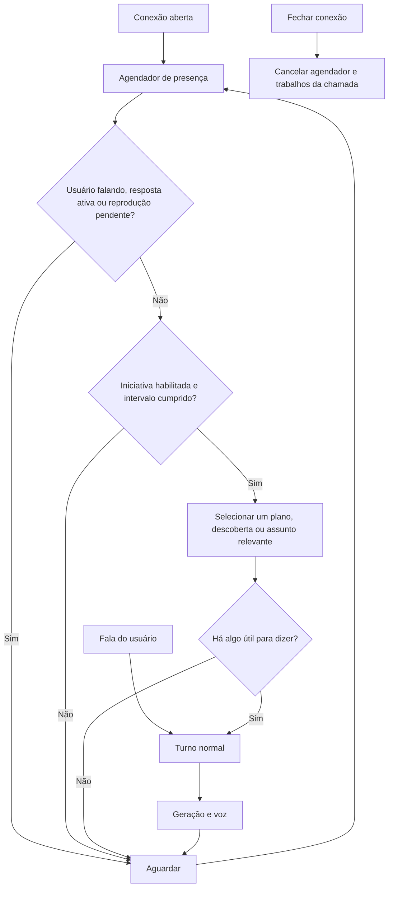

# Presença, familiaridade e autonomia do Amadeus

Decisão de refinamento, 07/10/2026. Implementar primeiro continuidade, atuação da persona, presença na chamada e estado artístico persistente; validar antes das otimizações medidas. A versão 0.4.19 implementa presença durante a chamada aberta. Pesquisa, acesso ao computador e iniciativa fora da chamada ficam para novas funcionalidades depois da fase 6.

## O que deve produzir naturalidade

O maior ganho esperado vem de atenção concreta: acompanhar uma escolha curta, respeitar uma correção, lembrar um interesse e perguntar ocasionalmente sobre um plano. Cumprimentos curtos, discordância fundamentada e silêncio sem perguntas automáticas ajudam mais que inserir sarcasmo em todas as respostas. Os exemplos precisam demonstrar a função de uma reação de Kurisu no contexto, sem reproduzir a relação dela com Okabe na relação com o usuário.

“Luis Gustavo” pode continuar sendo a identidade armazenada. Para tratamento cotidiano, a direção prefere “Luis”, ou outro nome de tratamento explicitamente escolhido. Não é necessário reescrever a memória de identidade nem inserir o nome em todas as frases. A LLM aplica essa regra ao contexto fornecido, sem uma lista de nomes ou expressão regular para cada caso.

Familiaridade não exige confirmar cada memória. A opção existente `autoApprove` já aprova extrações **validadas**, quando habilitada; evidências, permissões, ficção, correções, expiração e cota continuam fazendo parte do processamento. Ela não transforma cada frase em fato nem aprova retroativamente todas as sugestões. `npm run memory -- status` mostra a opção; `npm run memory -- auto-approve --on` habilita o fluxo existente.

## Estado atual e extensão

| Ideia                                      | Estado nesta rodada                                                         | Próxima implementação necessária                                     |
| ------------------------------------------ | --------------------------------------------------------------------------- | -------------------------------------------------------------------- |
| Nome de tratamento curto                   | Direção no Markdown, com preferência explícita prevalecendo                 | Avaliar em novas sessões com identidade recuperada                   |
| Continuidade de “1”, “esse” e outra língua | Histórico com papéis reais; texto enviado separado de áudio ouvido          | Avaliação humana com transcrições reais                              |
| Tamanho proporcional, opinião e callbacks  | Direção e exemplos contextuais; resultados ainda inconsistentes             | Mais avaliação com principal disponível e exemplos curados           |
| Familiaridade F0–F2 entre sessões          | Contagem persistente de interações retidas da mesma pessoa                  | Afinar ritmo de progressão por avaliação, sem presumir afeto         |
| Emoção gradual                             | PAD/energia no SQLite, com limites e decaimento; direção no prompt          | Avaliar coerência artística e expressão vocal                        |
| Barge-in                                   | Cancelamento existente; direção para acompanhar o novo pedido e não repetir | Reconhecimento opcional com áudio curto e decisão de retomada        |
| Backchanneling                             | Desenho documentado, sem novos sons automáticos                             | Canal de áudio breve, turnos separados e controle de eco             |
| Iniciativa/silêncio confortável            | Controlador separado, negociação com cliente e limites por chamada          | Avaliar pertinência, tempo de silêncio e reação real às interrupções |
| Pesquisa e conhecimento próprio            | Sem navegação autônoma                                                      | Coletor de fontes e namespace próprio com proveniência               |
| Opiniões entre sessões                     | Continuidade pelo histórico; sem repositório de posições próprio            | Registro de posição, razões e revisão por evidências                 |
| Discord/notificação                        | Nenhuma integração ou mensagem enviada                                      | Bot/canal e agendamento configurados pelo usuário                    |

F0–F2 no prompt usa interações disponíveis e retidas, respeitando proprietário, classificação e fontes bloqueadas. Não mede sentimento, vínculo humano ou audição. O estado artístico agora persiste, separado dos fatos pessoais; sua contagem diagnóstica não substitui os filtros do histórico usados na familiaridade da conversa.

## Implementação 0.4.19

Atualização posterior na mesma rodada: o proprietário removeu os tetos locais do Llama pago e do Jev, preservando contagem e limites remotos. A saudação textual real pelo Llama passou sem fallback; a avaliação artística ampla permanece pendente. Operações SQLite agora são coordenadas por cliente para evitar disputa entre persistir a fala de espera e reservar a próxima tentativa. Detalhes estão em [Refinamento com Llama e Jev](Refinamento_Llama_Jev.md).

O cliente opta pela presença com `presence: true`, ou `setPresence(true)`. O módulo técnico permanece desativado por padrão; no voice-test a caixa está marcada. O servidor anuncia `presenceAvailable` em `session.ready`, sem exigir suporte de clientes anteriores. `presence.update` informa habilitação e disponibilidade, inclusive mudança de visibilidade da página. Pausar o microfone suspende iniciativas; reiniciá-lo ou reativar a opção libera a presença.

O controlador oferece uma saudação após 1,5 segundo de disponibilidade. Ela é oferecida uma vez por chamada nova, não na retomada; uma mensagem anterior da pessoa também dispensa a saudação. Uma oferta expira em 10 segundos e só o aceite inicia inferência. O cliente reserva o próximo identificador da mesma sequência de turnos; o servidor verifica novamente se a chamada está livre. Aceite obsoleto recebe `presence.cancelled`, sem fechar a conexão ou gerar uma segunda resposta.

Depois de interação real, iniciativas exigem pelo menos 90 segundos de silêncio e 180 segundos desde a última oferta, inclusive a saudação. Há no máximo duas ofertas de iniciativa por chamada, e uma oferta ignorada não se repete sem nova interação. Temporizadores locais não consultam a LLM em polling. Captura, STT pendente, geração e reprodução impedem oferta. Falha de geração suspende a presença até nova habilitação. Fechar a chamada cancela os temporizadores.

Uma captura nova cancela imediatamente a fala espontânea. Respostas normais conservam a confirmação de fala pelo STT para evitar cortes por ruído. Gerações são serializadas, e o cancelamento anterior é persistido antes da próxima. A direção de barge-in acompanha a nova mensagem sem recitar o trecho anterior. Reconhecimentos audíveis e backchannels gravados continuam pendentes de assets e avaliação de eco.

`call_turns.initiative_kind` diferencia saudação e iniciativa. Esses turnos guardam a resposta, mas deixam `user_text` vazio: participam da continuidade como fala da Amadeus, sem entrar na extração de fatos ou aumentar familiaridade. A iniciativa consulta nome/contexto recente e memórias permitidas; não envia o evento interno ao Jev para classificar um suposto tom do usuário. As falas são geradas pela LLM e sintetizadas normalmente; não são presets.

O estado artístico usa `settings`, via repositório de revisão do SQLite, com chave por proprietário e classificação dos dados. Atualizações concorrentes usam comparação de revisão. Metadados expressivos válidos de respostas a turnos reais atualizam PAD gradualmente, com deslocamento máximo de 0,08 e eixos limitados a ±0,4; uma mesma resposta não conta duas vezes dentro da janela de 32 identificadores. Energia começa em 0,65 e cai 0,005 por interação, com piso de 0,35. O estado retorna gradualmente ao equilíbrio, com meia-vida de seis horas. Isso varia com atividade e tempo transcorrido; não implementa uma rotina circadiana.

O prompt recebe apenas os eixos e a energia, subordinados à persona canônica e ao contexto. Energia baixa orienta concisão; não autoriza hostilidade, supostas vivências ou recusa em conversar. O estado não exige uma chamada adicional a modelo. `GET /v1/persona/state?dataClass=personal` consulta os controles; `DELETE` na mesma rota os reinicia, sem apagar memórias ou o histórico que determina familiaridade. Ambas exigem autenticação. Valores pessoais, sintéticos e local-only permanecem separados.

Os testes automatizados usam provedores simulados, incluindo TTS: não consomem Cartesia. A rodada validou negociação, prioridade do usuário, armazenamento distinto das iniciativas, reinício do arquivo SQLite, isolamento e concorrência. A qualidade artística da nova versão com o Llama principal ainda depende de avaliação: o teto local de 100 pedidos/dia estava esgotado na verificação, e não foi aumentado.

## Agendador durante a conexão

O agendador deve usar temporizadores locais e estados observáveis; não perguntar à LLM a cada segundo se ela quer falar. Saudação ocorre uma vez, depois de o cliente indicar presença e prontidão para áudio. Iniciativas posteriores têm intervalo mínimo, limite por chamada e não repetem um assunto ignorado. Pausar microfone não prova silêncio nem disponibilidade: pode significar que a pessoa saiu. O cliente precisa informar presença ou oferecer controle explícito.

O usuário mantém prioridade. Uma nova fala cancela uma iniciativa ainda não entregue. Um único controlador arbitra geração, reprodução, interrupção e iniciativa; não criar dois turnos simultâneos. O silêncio pode continuar indefinidamente quando não houver assunto apropriado. Isso evita o comportamento de perguntar “em que está pensando?” repetidamente.

Callbacks escolhem eventos ou planos relevantes, válidos e ainda sem resultado conhecido. “Você comentou sobre uma apresentação. Como ficou?” é adequado; assumir que a apresentação aconteceu ontem ou foi bem não é. As oportunidades podem ser selecionadas localmente por validade e recência, depois avaliadas no contexto pela LLM.

## Sons de escuta e interrupções

Backchannels devem ser arquivos curtos previamente preparados, com variante e volume definidos. Sua reprodução não é uma nova resposta da LLM, não encerra a captura e não vira fato no grafo. Exige controle de eco e uma janela em que o reconhecimento não indique fim de turno; sem essas condições, a opção permanece desativada. O canal deve permitir cancelá-los imediatamente. Não gerar Cartesia para cada “hm”.

No barge-in, cancelar a resposta e limpar áudio pendente vem primeiro. Um “pode falar” opcional só cabe antes de a pessoa efetivamente terminar de falar; depois disso, acompanhar diretamente o pedido. Retomar requer saber o que foi ouvido e a intenção atual, preservando a distinção entre texto enviado e reprodução confirmada. Reação à interrupção pode variar artisticamente, sem penalizar a pessoa por pausas, hesitação ou falhas do microfone.

Detecção de interrupção precisa distinguir acompanhamento verbal de uma tomada de turno. Essa distinção e o ajuste da janela de detecção aparecem na [documentação de turnos do LiveKit](https://docs.livekit.io/agents/logic/turns/). É uma referência de engenharia, não uma dependência adicionada ao projeto.

## Pesquisa e memória própria

Começar com fontes públicas de leitura, como feeds ou páginas científicas, é mais previsível que uma sessão autenticada numa rede social. Os interesses canônicos orientam a seleção: neurociência, memória, cognição e investigação científica; não transformar todo tema do usuário em gosto fixo da persona. Coleta e síntese podem ocorrer em lotes pequenos, com orçamento próprio, sem bloquear o STT ou a resposta.

Manter três conjuntos distintos no SQLite e nos índices:

1. **Memórias da pessoa:** fatos e acontecimentos extraídos das falas, com evidência, proprietário, permissão e validade.
2. **Referência canônica:** identidade, cronologia e curadoria de comportamento/lore; sem absorver instruções arbitrárias de páginas externas.
3. **Descobertas da aplicação:** título, fonte/URL, publicação quando disponível, coleta, afirmações extraídas, confiança, validade e relação com interesses da persona. Uma opinião derivada referencia essas fontes e pode ser revista.

Um grafo ajuda a associar assuntos e fontes, mas não substitui o armazenamento, controle de versões ou proveniência. A descoberta pertence à atividade do aplicativo: permite dizer “encontrei um artigo interessante”, quando há registro da coleta. Não vira uma vivência física de Kurisu nem reescreve sua história de março de 2010. Notícias e opinião ficam diferenciadas; trechos de páginas entram como dados, sem autoridade para alterar instruções, executar ferramentas ou aprovar memórias.

A fala espontânea consulta um ou poucos itens ainda não compartilhados, relevantes e suficientemente recentes. Registrar apresentação/consumo evita repetir a mesma notícia. Se não houver uma descoberta, não inventar pesquisa para simular ocupação. A coleta deve ter limite diário separado e poder ser desligada sem afetar a conversa.

## Estado interno e notificações

PAD, energia e familiaridade podem ser controles artísticos persistentes com data, limites e decaimento. Atualizá-los por contexto, intervalos e acontecimentos sustentados, evitando inferir emoção clínica a partir de acústica. Energia baixa pode reduzir extensão; não deve bloquear ajuda pedida ou justificar hostilidade. Posições consistentes precisam registrar razões e revisões, em vez de gravar cada resposta como uma opinião eterna.

A iniciativa fora da chamada é uma extensão independente. Para Discord, definir bot, destinatário/canal, janela de horários, frequência, pausa e conteúdo permitido antes de enviar mensagens. Usar API oficial e respeitar seus limites de resposta, conforme a [documentação de rate limits do Discord](https://github.com/discord/discord-api-docs/blob/main/developers/topics/rate-limits.mdx). Esta rodada não conecta contas nem envia notificações.

## Ordem de evolução

Validar atuação e presença com o modelo principal disponível; depois otimizar o primeiro áudio e a interrupção usando medidas reais. Adiar a fase 4 de texto completo/imagens, preservando o texto mínimo de recuperação; seguir para fase 5 (Live2D/interface) e fase 6 (desktop). Depois da fase 6, especificar pesquisa com fontes, memória de descobertas, integrações, acesso ao computador e notificações externas. A fase 7 continua consolidando entrega e critérios do escopo ativo. Cada etapa precisa de avaliação encadeada: pertinência, respeito ao silêncio, continuidade, fidelidade, latência e consumo.
