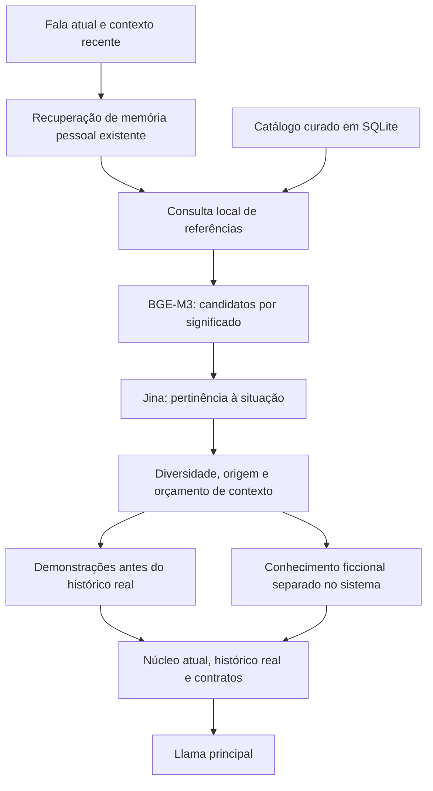

# Referências contextuais da persona

Implementação de 07/10/2026. O Llama continua principal; núcleo, temperatura, contrato de memória e expressão permanecem como referência. A mudança adiciona recuperação de demonstrações editoriais e conhecimento ficcional. A integração foi seguida pela [avaliação textual da rodada 2](../analysis/Resultados_Refinamento_Llama_Rodada_2.md); naturalidade e fidelidade continuam sem aprovação. A curadoria é proposta editorial, ainda sem aceite humano.

## Banco e procedência

[corpus-examples-v1.md](../../code/backend/assets/persona/corpus-examples-v1.md) contém 33 exemplos de atuação e seis resumos de lore. Cada bloco identifica situação, função, contexto original, motivo da adaptação e IDs do corpus preparado. Há exemplos com continuação do diálogo, não apenas respostas isoladas.

`npm run prepare:persona-examples` confere autoria Kurisu, revisão fixada, SHA-256 do snapshot contra o manifesto e offsets dos trechos. Gera `corpus-examples-v1.json`, com links e linhas do original, além de seções e linhas de `source-v0.4.md`, `reaction-repertoire-v0.2.md` e `curadoria.pt-BR.md` que fundamentam as direções. O JSON é um artefato gerado: edite o Markdown e recompile, em vez de editar ambos independentemente.

Uma referência de atuação transfere a função da reação. Não transfere para a pessoa a relação com Okabe, a agressividade, a cena, o romance ou uma experiência física. Os exemplos são adaptações originais em pt-BR, não traduções oficiais. Os demais candidatos entre as 758 falas preparadas continuam disponíveis para curadoria; não foram declarados integralmente revisados.

## SQLite e isolamento

A migração `0011_persona_references` cria:

- `persona_reference_documents`: documento, tipo, revisão editorial, payload com procedência e hash.
- `persona_reference_embeddings`: vetor por documento, modelo local e hash da versão correspondente.

Essas tabelas não têm vínculo com `memory_facts`, proprietário, aprovação automática de fatos ou retenção pessoal. Na instalação com o snapshot presente são 79 documentos: 33 estilos, seis resumos editoriais e 40 trechos brutos de `Story_EN.md`. Em outra máquina, o catálogo compilado funciona sem o snapshot; os 40 trechos brutos não são importados quando o arquivo local está ausente.

Os trechos brutos têm `kind=lore-source`, `reviewed=false`: ficam arquivados, fora do índice e do prompt. Os seis resumos permitem discutir conhecimento da obra. Todos têm `autobiographicalEligible=false`; cronologia posterior ou não verificada não amplia o recorte de março de 2010 da Amadeus. A fonte é secundária, não prova de cânone ou física real.

Sincronização substitui apenas este catálogo, remove referências retiradas e invalida vetores quando o payload muda. A gravação de um vetor exige o hash atual: uma inferência antiga não pode sobrescrever uma edição nova. Histórico e fatos pessoais permanecem independentes.

## Recuperação e montagem



O BGE-M3 e o Jina já existentes são compartilhados com a memória, com inferência estritamente local. A memória pessoal tem prioridade: a busca de exemplos começa depois dela. Nenhuma nova chamada Jev/LLM decide a situação e nenhuma lista de palavras ou nomes interpreta a fala. A consulta começa pela fala atual, com contexto recente limitado para não perder o pedido novo por truncamento.

A busca de candidatos considera esse contexto, mas o Jina recebe separadamente a fala atual, sem rótulos de formatação. A verificação local encontrou que incluir os rótulos no reranqueamento alterava indevidamente a seleção; a separação corrige esse acoplamento sem regras por idioma, nome ou palavras-chave. O cache distingue contexto e foco atuais.

O seletor usa pertinência, uma janela relativa de pontuação e diversidade. Dois exemplos apoiados na mesma intervenção original não ocupam duas posições. O número configurado é um máximo: uma saudação, elogio ou consulta sem referência pode retornar poucos exemplos ou nenhum. A relevância não é probabilidade de verdade ou certificado de personalidade.

As demonstrações são mensagens `user/assistant`, explicitamente marcadas, com metadados neutros válidos nas falas de exemplo. Entram antes do histórico real e nunca são persistidas como turnos da pessoa. Função e conhecimento ficcional têm delimitação própria no sistema; os contratos vigentes prevalecem. Reparações preservam as referências escolhidas; uma inferência atrasada não modifica uma geração iniciada.

## Quantidade, orçamento e tempo

Padrões configuráveis:

| Variável                         | Padrão | Alcance                                                               |
| -------------------------------- | -----: | --------------------------------------------------------------------- |
| `PERSONA_REFERENCES_ENABLED`     | `true` | Habilitar/desabilitar a recuperação                                   |
| `PERSONA_REFERENCE_MAX_EXAMPLES` |      6 | Máximo 12 exemplos de atuação                                         |
| `PERSONA_REFERENCE_MAX_LORE`     |      2 | Máximo quatro resumos de lore                                         |
| `PERSONA_REFERENCE_CHARACTERS`   |   6000 | Orçamento do sistema adicional e mensagens renderizadas; máximo 16000 |
| `PERSONA_REFERENCE_TIMEOUT_MS`   |   1000 | Espera máxima da busca na chamada; máximo 2000 ms                     |

O orçamento inclui marcadores e metadados, além da fala. A ausência de índice, modelo indisponível ou estouro da espera conserva o fluxo com a referência estática existente. Não força um exemplo genérico. Apenas uma consulta nova por serviço pode ocupar os modelos de cada vez. Consultas são armazenadas em cache de RAM limitado a 32 entradas; não são gravadas no SQLite.

A indexação é explícita, fora do turno. Modelos são aquecidos na inicialização quando há vetores disponíveis; isso pode aumentar o tempo de subida da API. Na verificação inicial, o Jina acrescentou aproximadamente 0,3–0,7 segundo por consulta aquecida e cerca de três segundos na primeira consulta fria. São observações locais, não garantia de latência. O cache evita inferência repetida para a mesma consulta.

Essa etapa prioriza pertinência. Não foi demonstrada melhora de primeiro áudio; a recuperação acrescenta trabalho local e os exemplos aumentam a entrada do Llama. `personaReferences` nas métricas mede o estágio. `PERSONA_REFERENCES_TIMEOUT`, `UNINDEXED` e `DEGRADED` indicam fallback estático, sem encerrar a conversa.

## Preparação e uso

Na pasta `code/backend/api`:

```powershell
# Ao alterar os exemplos Markdown; exige o snapshot local para conferir origem
npm run prepare:persona-examples

# Importa e indexa as referências na instalação, sem chamadas de provedores
npm run persona:references -- index

# Reinicie a API depois de importar/reindexar
npm run dev

# Inspeciona o índice sem inferência
npm run persona:references -- status

# Diagnóstico com consultas sintéticas e banco separado; somente modelos locais
npm run persona:references -- check --database=file:./data/persona-reference-check.db
```

Editar o banco por outro processo requer reinício da API para recarregar o catálogo e os vetores. Um arquivo Markdown desatualizado em relação ao catálogo compilado é recusado. O build carrega cópias dos dois arquivos curados, sem depender dos originais ignorados pelo Git.

## Comparação controlada preparada

```powershell
# Somente preparação; zero chamadas remotas
npm run eval:conversation-quality -- --variants=examples-0,examples-2,examples-4,examples-6 --samples=10
```

O padrão desses braços é desenvolvimento: seis conversas, dez amostras, quatro tetos, até 720 turnos. Autor padrão é Llama. Núcleo atual, estado, memória de exemplo, amostragem e roteamento são iguais; somente o teto de exemplos varia. Lore fica desativado para isolar atuação. Os exemplos estáticos já existentes permanecem em todos os braços: zero significa zero exemplos adicionais.

O relatório registra quantidade efetiva, IDs, fontes, caracteres, duração da recuperação e mensagens finais. Um braço de seis posições pode usar uma só; não deve ser apresentado como seis exemplos efetivos. A ordem gira entre amostras; inferências locais reutilizadas por cache são identificáveis pelas medições e não devem ser confundidas com melhoria do provedor.

A execução paga usa `--run`, o orçamento compartilhado da rodada autorizada e o juiz independente. Foi preparada sem inferência paga durante a integração e depois executada na segunda rodada. O teto de US$ 0,25 não é renovado pelo novo experimento e não há garantia de que ele comporte a rodada inteira. Prompts/corpus são fotografados por hash no relatório. Coincidência literal com os reservados é conferida; isso não certifica independência semântica ou cenas oficiais distintas. H01/H02/H14/H31 continuam diagnósticos já observados.

Os testes locais verificam migração, isolamento de fatos, invalidação de vetores, cap de contexto completo, cancelamento, seleção vazia e injeção sem persistência de demonstrações. As consultas reais do BGE/Jina verificam recuperação, não fidelidade das respostas geradas pelo Llama. Calibração humana e avaliação de geração continuam necessárias.

Verificação final: 551 testes da API, formatação, lint, typecheck e build passaram. O índice da instalação foi preparado com 79 documentos e 39 vetores. O diagnóstico local `data/refinement/1791415390261-persona-reference-check.json` recuperou elogio direto, reparo, saudação/escuta e discordância nas consultas correspondentes, e somente Reading Steiner na consulta de lore. Consulta desconhecida e a consulta em inglês retornaram seleção vazia; isso não comprova cobertura multilíngue. Nenhuma chamada remota foi feita. O saldo contabilizado da rodada anterior permaneceu US$ 0,2322949165 de US$ 0,25.
