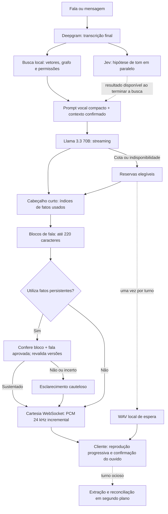
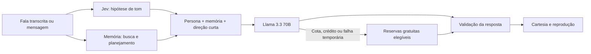

# Refinamento com Llama e Jev

## Recuperação independente da cota auxiliar — persona 0.4.17

A recuperação de memórias confirmadas e elegíveis não depende da disponibilidade de Jev ou GPT-OSS. A checagem introduzida na versão anterior omitia os fatos quando ambos estavam sem cota, causando respostas como “não tenho como saber seus gostos” apesar de eles estarem salvos. Essa condição foi removida.

A verificação de resposta tem três resultados: `true` indica suporte semântico; `false` indica rejeição explícita ou fonte sem permissão/versão/validade atual; `null` indica revisão auxiliar indisponível ou inconclusiva. Sem revisão auxiliar, a LLM principal continua recebendo os fatos selecionados e o contrato de evidência, sem uma segunda geração que os remova. O resultado é registrado em `memoryReviewUnavailable`, sem contar como aprovação semântica. Há menos supervisão nesse modo; o modelo principal ainda pode errar. Política de memória, confirmação, titularidade, permissão, versão e expiração continuam obrigatórias, revalidadas antes e depois da tentativa de revisão. A extração e aprovação de novas memórias continuam exigindo suas etapas habituais e cota própria.

Somente uma rejeição explícita antes da primeira fala aciona a tentativa única sem os fatos rejeitados. Falta de cota do auxiliar não é rejeição. A recuperação permanece sem regras por gênero, nome, palavra ou idioma. O documento vocal orienta também a resolver apelidos pelo diálogo, sem apresentações repetidas ou transformar a persona numa terceira pessoa.

Cartesia tem `voiceId` principal, `fallbackVoiceId` opcional e `fallbackVoiceApiKeyEnv` para uma credencial distinta. A reserva mantém modelo, formato, política e orçamento; só é tentada depois de falha recuperável e antes de entregar áudio, sem repetir um trecho parcialmente fornecido. Cota da Cartesia bloqueia temporariamente a credencial da conta que falhou. Com a mesma chave, abrange ambas as vozes; com chave de outra conta, a reserva continua elegível. Indisponibilidade temporária de uma voz bloqueia somente aquela voz. O orçamento local de TTS permanece compartilhado, sem aumento nem reinicialização dos contadores. [Créditos e planos Cartesia](https://www.cartesia.ai/pricing).

Nesta configuração, a principal permanece `dd8e6bee-2225-418a-9e68-753f3ec73b6b` com `CARTESIA_API_KEY`; a reserva é `0d7aa08b-81e4-4ad3-8f93-129cbb3585ce` com `CARTESIA_FALLBACK_API_KEY`, da conta do parceiro de equipe. Qwen foi retirado da configuração ativa de produção e o serviço iniciado durante o diagnóstico foi desligado. Se ambas as contas ficarem indisponíveis, permanece o fallback textual existente.

Validação real: o banco tinha 41 fatos confirmados e elegíveis; nome completo, preferência por RPG/terror e jogos salvos foram recuperados e respondidos corretamente com os dois revisores sem cota, sem gravação de novas memórias. A recomendação também usou gostos existentes para sugerir uma opção nova, sem dizer que já era um gosto salvo. Isso valida esses casos, não a qualidade de qualquer futura indicação ou a naturalidade geral. A primeira tentativa com o ID reserva usou a chave principal e retornou `QUOTA_EXCEEDED`; portanto não dizia nada sobre a conta do parceiro. Com a chave correta, uma única frase sintética gerou 119.040 bytes de PCM mono a 24 kHz (2,48 s de áudio, 1,71 s de síntese). A voz principal não foi chamada nesse teste. O teste não inclui STT ou reprodução no navegador.

O diagnóstico local identificou ainda HTTP 422 causado pelo campo interno `speechContextId` enviado ao serviço de fala com contrato estrito. O adaptador HTTP agora omite esse campo; há regressão específica. Isso não reativa Qwen na produção.

Verificação final desta correção: 491 testes da API em 61 arquivos, formatação, lint, tipos e build passaram. As regressões incluem continuidade com revisão indisponível, rejeição explícita, revogação durante revisão, retorno inconclusivo do revisor reserva, recuperação após falha do Jev, voz reserva com outra credencial e proibição de troca após áudio parcial. Não foram aumentados limites nem reiniciados contadores de uso.

As seções 0.4.16 e 0.4.15 abaixo registram rodadas anteriores. Esta decisão substitui a omissão de fatos por falta de cota e o tratamento de indisponibilidade como rejeição.

Decisão em 06/10/2026: usar `meta-llama/llama-3.3-70b-instruct` pago como LLM principal e conservar os modelos gratuitos como reservas. Llama e `typesafe/jev-1.13` usam a variável `OPENROUTER_API_KEY` existente. Não há contratação de hospedagem ou fine-tuning nesta integração.

## Correções de conversa e memória — persona 0.4.16

O contrato agora separa lembranças pessoais, conhecimento geral e propostas novas. Uma indicação pode combinar gostos confirmados com uma opção ausente da memória; sua compatibilidade é hipótese. Dizer que a pessoa já gosta, possui ou jogou essa opção continua exigindo evidência. Isso vale semanticamente em qualquer assunto/idioma, sem gatilhos por palavras. A mesma distinção está na direção de memória, na declaração de índices, no Jev e no revisor reserva.

A rodada real também encontrou uso de preferências com `memory:[]`. Por isso, quando fatos são efetivamente fornecidos à LLM, cada bloco é conferido contra **todo o contexto elegível**, independentemente dos índices autodeclarados. Isso cobre omissões de índices e evita rejeitar um fato disponível apenas porque a LLM citou outro índice. O cabeçalho não dispensa a auditoria. Sem fatos, não há essa revisão. Uma saudação com fatos irrelevantes deve ser aceita pela rubrica como fala sem afirmações pessoais, e não transformada em pergunta de lembrança. Esse ajuste pode acrescentar revisão/latência/cota a turnos com fatos recuperados, em troca de impedir o desvio observado; os limites locais permanecem iguais.

A fala atual também é fonte de evidência, mesmo antes de extração/armazenamento. A revisão distingue declaração, hipótese, pergunta e premissa biográfica: confirmar um gosto sustentado não é negá-lo, mas perguntar como foi um evento pressupõe que aconteceu. Baixa confiança ou `uncertain` no Jev retornam inconclusivo (`null`), permitindo a revisão independente com GPT-OSS-20B; não viram aprovação nem rejeição categórica.

Se a revisão falhar **antes de qualquer fala da resposta**, o backend fecha a geração rejeitada e tenta uma única resposta nova **sem fatos persistentes**, mantendo somente conversa atual, histórico confirmado, persona, classificação e limites. Não inclui o rascunho rejeitado. Essa tentativa pode responder conhecimento geral ou reconhecer uma lembrança indisponível; não recebe personalização da memória. Depois de fala já fornecida, uma continuação não sustentada continua retida. Essa degradação evita transformar toda pergunta em “pode me lembrar?”, mas consome uma geração adicional e aumenta a latência; é medida em `memoryReplyRecoveries`. Não permite cota extra nem ignora revogação/versionamento de fatos.

Naquela rodada, uma checagem local omitia os fatos quando ambos os revisores estavam sem cota. Essa decisão foi removida em 0.4.17 por interromper a lembrança de fatos já confirmados.

O corpus de FrancescoCaracciolo/Amadeus havia sido adquirido em `feat/interface`, mas não fazia parte do prompt nesta branch. Sua curadoria e proveniência foram trazidas para este refinamento; [canon-conversation-v1.md](../../code/backend/assets/persona/canon-conversation-v1.md) passa a orientar produção, recuperação e comparação. São adaptações originais das funções observadas nos diálogos, junto da persona, skill e catálogo fornecidos. Não são falas canônicas traduzidas ou dados pessoais.

| Fonte                              | Uso atual                                                                                                                                                |
| ---------------------------------- | -------------------------------------------------------------------------------------------------------------------------------------------------------- |
| Persona v0.4 e direção de conversa | Identidade, recorte, honestidade e regras compiladas em `voice-runtime-v1.md`; documentos completos preservados e referências selecionadas na comparação |
| Skill de Amadeus                   | Seção operacional aprovada no núcleo vocal; arquivo completo preservado                                                                                  |
| Catálogo de reações                | Funções de reação na compilação vocal; repertório documental também na comparação                                                                        |
| Diálogos externos                  | Curadoria de limites, curiosidade, humor e vulnerabilidade contextual, com revisão/linhas de origem e exemplos próprios em pt-BR                         |
| História externa                   | Contextualiza as cenas e o limite cronológico; não cria vivências posteriores ao recorte nem lembranças do usuário                                       |
| Memória pessoal                    | Recuperação semântica/grafo/permissões existentes; apenas fatos relevantes entram no contexto da conversa                                                |

Não há indexação ou recuperação dinâmica das 733 falas distintas em produção; o snapshot bruto continua local. O prompt inglês externo não substitui a identidade de Amadeus. Uma recuperação futura de cenas/lore requer namespace próprio, curadoria e avaliação; não será misturada ao grafo pessoal.

O núcleo vocal ficou em **8.671 caracteres**, contra 11.242 da versão anterior; o prompt completo de referência tem 22.529, com teto explícito de 23.500. A curadoria aparece uma vez, depois do contrato factual, para que este não apague a atuação da personagem. Sem fatos selecionados, a direção de memória usa somente o complemento contextual curto (**728 caracteres**), evitando impor regras extensas de recordação a um cumprimento. Os números medem caracteres, não tokens ou latência. A conversa no Llama pago agora envia temperatura explícita de 0,6; extração/revisão LLM conserva 0 e as reservas conservam seus parâmetros. É um ajuste experimental de estabilidade, não garantia de gramática ou fidelidade.

Jev avalia tom e clareza do pedido na **mesma chamada**. Tom só entra no prompt se disponível ao terminar a busca. Clareza pode chegar durante a geração, com prazo próprio de até 1 segundo, e é consultada sem espera antes da primeira fala. Uma decisão `clarify` com confiança de pelo menos 0,90, ou `clear` abaixo de 0,60, produz uma pergunta curta de reparo. Não se exige memória pessoal para compreender uma recomendação. Resultado ausente, inválido, tardio, falta de cota ou análise desativada deixam a resposta principal seguir; não há aumento de pedidos por turno, somente mais um critério na chamada existente. Trata-se de classificação probabilística, não garantia de compreensão ou revisão geral de gramática/fatos.

Também foi retirado um exemplo de saudação do contrato de formato para não induzir cópia repetida. Cabeçalho/rodapé sem wrapper são aceitos apenas como objetos estruturados válidos; rodapé não pode alterar memória nem conter texto posterior. Objetos arbitrários e vazamentos continuam bloqueados antes da síntese.

No cliente, temporizadores e `audio.end` podiam somar offsets de trechos futuros como se estivessem ouvidos. Isso produzia confirmações em excesso e podia contaminar o histórico confirmado. Agora trechos ainda não iniciados não avançam confirmação; o fim do stream consulta só o último trecho iniciado e não duplica o aviso final. O limite de 180 confirmações/minuto permanece. Um fechamento por limite informa a causa específica, em vez de `Invalid voice event`; o log recebido não distingue sozinho qual contador estourou.

Os ensaios reais usam falas e fatos fictícios, limites vigentes e relatórios locais em `data/refinement/`. Nenhuma memória pessoal foi criada/editada e nenhum teto foi elevado. `check:memory-review` cobre quinze casos, `check:input-clarity` seis, e `check:voice-latency` até oito, incluindo indicação nova e continuidade pelo histórico. `passed` no último verifica funcionamento; avaliar fidelidade/naturalidade lendo `spoken` é uma etapa separada. Respostas genéricas ainda aparecem e não são aprovadas artisticamente pelo sucesso do protocolo. Testes com contexto fixo não substituem uma chamada real com STT, recuperação local e escuta humana.

Resultados da rodada de 06/10/2026 (relatórios com horário UTC de 07/10): 14/15 decisões Jev corresponderam ao esperado; uma confirmação de preferência ficou inconclusiva, abaixo de 0,70, e requer reserva. A bateria vocal teve 7/8 sucessos técnicos antes de corrigir o uso da fala atual como fonte; o caso restante passou na repetição após essa correção. A indicação com preferências gerou uma opção nova em cerca de 3,7 s até o primeiro PCM; o fragmento ambíguo pediu repetição em cerca de 2,9 s. Outras tentativas tiveram palavras deformadas e cumprimentos de atendente: esse problema artístico ainda não está encerrado. Os números são observações de amostra pequena, não metas comprovadas de latência.

Ao atingir a cota de Jev durante os ensaios, a indicação passou no teste da tentativa sem memória, em cerca de 6,5 s até o primeiro PCM. Não era uma indicação personalizada por memória nessa tentativa. A revisão independente também atingiu sua cota; nenhum limite foi aumentado. A indisponibilidade do classificador de clareza deixa a geração principal seguir, como previsto; os seis casos de clareza foram avaliados enquanto havia cota. Novas medições com revisão disponível precisam aguardar renovação da cota ou configuração deliberada de outro orçamento/provedor.

Na última repetição, a checagem do orçamento mínimo já começou **sem memória**, com zero revisões e zero regenerações por conferência. O texto ainda apresentou uma indicação nova. O ensaio de áudio falhou: Cartesia `sonic-3.6` retornou `QUOTA_EXCEEDED`, e o adaptador local de reserva retornou `PROVIDER_UNAVAILABLE`. Não foi determinado se o limite remoto da Cartesia é de taxa, saldo ou franquia; não há prazo de renovação comprovado. O relatório agora registra adaptador/modelo e erros sanitizados de cada tentativa de áudio. Não são usadas mensagens brutas de rede nem credenciais. Não houve aumento de limites ou cobrança habilitada.

A validação local final passou: 476 testes em 64 arquivos da API e 42 do cliente, formatação, lint, tipos, build e importação do prompt compilado. O teste de voz com revisor habilitado reproduziu uma corrida SQLite `TRANSACTION_ACTIVE`: a consulta de uso ocorria durante uma reserva. Leituras, reservas e acertos de uso agora compartilham a fila por conexão, inclusive entre instâncias do repositório. A repetição passou sem mascarar o erro com aprovação ou dispensar a conferência.

## Otimização do fluxo vocal — persona 0.4.15 (registro anterior)

Esta seção registra a otimização anterior. As alterações de 0.4.16 acima prevalecem. A arquitetura mantém geração, recuperação de memória e extração independente; reduz esperas sequenciais sem remover a conferência de lembranças.



Mensagens textuais entram diretamente na busca. Prévias do microfone permanecem locais. Não há chamada de planejamento de memória no caminho vocal comum. A análise de tom aproveita somente a janela da busca: seu resultado entra se já estiver disponível, caso contrário é cancelada antes da geração. Portanto, uma busca rápida pode seguir sem Jev; não existe uma espera adicional de 600 ms para aplicar tom.

O prompt de produção conserva direção principal, repertório de reações e a seção operacional aprovada da skill. `voice-runtime-v1.md` reúne instruções do dossiê para esse fluxo. Os documentos originais e o prompt completo permanecem disponíveis para comparação/avaliação; não são todos reenviados integralmente em cada turno. O contrato curto precede a fala: `<expression>{"memory":[]}</expression>` ou uma lista de índices inteiros. Intenção, emoção e intensidade ficam em um segundo `<expression>` no final. Cabeçalhos antigos ainda são aceitos. O primeiro trecho pode usar expressão neutra antes de chegar o rodapé; ele não muda retroativamente áudio já entregue. Os presets artísticos ainda não alteram parâmetros nativos do TTS (`deliveryApplied: false`).

A primeira parte completa pode ser liberada após **700 ms** de texto falável, com pelo menos **24 caracteres**, permitindo que uma resposta curta completa comece antes do rodapé expressivo. O tempo começa depois do cabeçalho e não inclui STT/rede. Os demais blocos mantêm até 220 caracteres e pausas naturais. O prompt base vocal tem 11.242 caracteres contra 19.249 do completo, antes dos complementos de memória/tom e histórico; redução de aproximadamente 42% em caracteres, não uma medição equivalente de tokens.

Cartesia reutiliza o contexto entre blocos enquanto ele está válido. A API expira contextos um segundo depois do último áudio; a integração deixa margem de rede de 500 ms e renova o ID quando o próximo bloco demora. Portanto, não há garantia de prosódia contínua após uma pausa longa da LLM. Os parâmetros de voz permanecem iguais, e as transcrições incluem espaços nas fronteiras. `max_buffer_delay_ms: 0` evita empilhar o agrupamento do Amadeus com o buffer remoto. Identificadores de flush associam a conclusão ao bloco correto e descartam confirmações vazias anteriores. [Contextos oficiais](https://docs.cartesia.ai/use-the-api/tts-websocket/contexts), [buffering oficial](https://docs.cartesia.ai/use-the-api/tts-websocket/buffering), [flush IDs](https://docs.cartesia.ai/use-the-api/tts-websocket/context-flushing-and-flush-i-ds). Continuidade e expressividade precisam de escuta.

Cada tentativa de LLM do fluxo vocal tem **8 segundos até o primeiro conteúdo textual**. Uso de tokens sem texto não encerra esse prazo. Ao expirar, a requisição é cancelada e o roteador tenta a próxima reserva elegível, emitindo o aviso/preset uma vez. Um adapter que ignore cancelamento não retém o roteador. Depois do primeiro texto, o prazo deixa de valer: não corta uma resposta longa nem permite repetir texto parcialmente entregue. Cancelamento do usuário continua prioritário. O prazo é por tentativa; uma cadeia de reservas lentas ainda pode ultrapassar oito segundos, e tentativas canceladas mantêm a reserva conservadora de uso quando não há medição remota.

O servidor envia `audio.start`, frames binários de 20 ms, `audio.end` com comprimento real e `audio.abort` em falha parcial. O cliente inicia após 100 ms de PCM recebido, sem esperar a síntese completa, e exclui o preenchimento do último frame da confirmação. Interrupção cancela o contexto de síntese. Falha depois de entregar PCM não troca para outro TTS nem repete o bloco; conserva o texto e registra a falha. Antes de qualquer PCM, o fallback local continua disponível. Atualize também a página do Voice Test para carregar esse protocolo aditivo.

A conferência factual ocorre **antes de cada bloco que usa lembranças**, incluindo os blocos anteriores aprovados para preservar contexto de pronomes/negações. Uma continuação sem apoio é bloqueada, embora a parte anterior já tenha sido entregue. O contexto enviado contém somente os fatos declarados, revalidados pelo serviço. Cabeçalho ausente/antigo com fatos mantém a conferência conservadora; não vira permissão automática. Respostas longas podem consumir mais pedidos de revisão. A rubrica distingue paráfrase/tradução/cautela de afirmações adicionais e preserva o mínimo de confiança de 0,70.

Consultas de embeddings idênticas usam cache local limitado a 64 vetores, identificado pelo hash da consulta e modelo. Não guarda respostas ou decisões de permissão: cada recuperação consulta fatos/versões atuais. A indexação persistente já ocorre em segundo plano, mas até 16 passagens ausentes ainda podem ser indexadas durante a busca para não perder fatos recém-confirmados. Modelo frio ou índice desatualizado ainda pode aumentar a latência.

O preset de fallback é um WAV local de quatro segundos, mono PCM16 a 24 kHz, em `data/voice-presets/provider-wait.wav`. A frase atual é “Hmm, só um instante. Tive um probleminha aqui, já resolvo.” O roteamento não espera sua reprodução. `npm run prepare:voice-presets` prepara o arquivo com o clone ativo e grava manifesto/hash; só essa preparação chama Cartesia. Arquivo ausente/incompatível resulta em texto, sem TTS durante o problema. Alterar frase/clone/referência exige preparar novamente e reiniciar. Os arquivos ficam fora do Git.

Reservas e liquidações de uso no SQLite agora compartilham a mesma fila de escrita. Chamadas de rede ficam fora da transação. Nenhum orçamento foi elevado, nenhum modelo adicional pago foi ativado e não houve treinamento ou instalação de pesos novos.

### Verificação desta otimização

Na rodada de quatro casos `voice-latency-2026-10-06T23-31-53.695Z.json`, os primeiros áudios ficaram em 3,3 s (saudação), 2,6 s (saudação em inglês), 2,4 s (RPG) e 6,3 s (lembrança do café), sem falhas de áudio, recuperação de formato ou revisão indevida. O café teve suporte Jev de 0,96. A rodada precede o ajuste final do mínimo de 40 para 24 caracteres e o prazo de primeiro texto. É um ensaio sem STT, busca local, persistência real ou reprodução no navegador, não uma promessa de latência total.

Uma chamada adicional correta levou 45,9 s até o áudio, dos quais 43,1 s foram espera pelo primeiro token do OpenRouter. Esse caso motivou o prazo de oito segundos, validado com relógio controlado e fallback antes de qualquer texto. Os números acima não ocultam esse outlier; rede e endpoints externos variam. A meta de dois segundos em conversa completa continua sem comprovação.

Após os ajustes finais, `voice-latency-2026-10-06T23-37-35.340Z.json` revalidou a lembrança fictícia: primeiro áudio em 3,9 s, resposta sustentada com confiança Jev de 0,82, sem recuperação nem erro de áudio. Uma repetição isolada não permite atribuir todo o ganho ao código, pois endpoints e tempos da rede variam.

Os seis casos de `memory-review-2026-10-06T23-24-54.238Z.json` passaram: paráfrase cautelosa e tradução foram aceitas, ranking inventado, plano como acontecimento, negação sem apoio e dado adicional foram rejeitados. O limiar permaneceu em 0,70. É uma amostra pequena e não comprova fidelidade geral da persona; as respostas comuns ainda exibiram formulações genéricas.

Validação final: **455 testes da API em 63 arquivos e 39 testes do cliente passaram**, assim como typecheck, lint, formatação e build. As regressões incluem áudio antes da conclusão, flush inicial zero/confirmações vazias, renovação de contexto expirado, interrupção, revisão incremental, cancelamento de tom, cache com revogação de fato e fallback por prazo inicial. Os arquivos locais de áudio/relatórios continuam ignorados pelo Git.

### Fine-tuning local

A máquina tem uma RTX 4060 com aproximadamente **8 GB de VRAM**. É possível experimentar QLoRA em modelos pequenos (por exemplo 3B/8B), com contexto e batch reduzidos, dependendo da implementação e da memória disponível. O mínimo absoluto publicado pelo Unsloth é 6 GB para QLoRA 8B e 41 GB para 70B; mínimos não garantem uma configuração útil. [Requisitos oficiais](https://unsloth.ai/docs/get-started/fine-tuning-for-beginners/unsloth-requirements).

Um adapter treinado localmente não pode ser anexado ao Llama padrão servido pelo OpenRouter. Seria necessário executar o modelo ajustado localmente ou usar um provedor que hospede esse adapter. Treinar pode melhorar estilo e permitir reduzir exemplos no prompt, mas não acelera por si só a geração do mesmo modelo. Um modelo menor executado localmente tem outro perfil de custo/latência/qualidade e exigiria avaliação própria. Essa etapa continua como experimento de refinamento; nenhum fine-tuning foi feito aqui.

## Histórico: correção após o Voice Test — persona 0.4.14

O Voice Test revelou que uma saudação podia virar uma resposta sobre lembranças ausentes. O planejador classificava todo contexto vazio de fatos como `unknown`, e indisponibilidade do extrator produzia `unavailable`; esses estados acionavam a revisão até para conversa comum. Ao falhar, ela substituía a resposta por um pedido para lembrar um detalhe. A direção principal também ainda afirmava, incorretamente, que não existia memória persistente.

O fluxo vocal agora **não chama o planejador remoto por turno**. A geração principal decide semanticamente se sua resposta utiliza fatos persistentes e declara somente seus índices: `"memory":[]` ou `"memory":[0]`, no mesmo cabeçalho de expressão. O backend remove esse campo, valida índices e separa a revisão factual da conversa comum. Não há reconhecimento por palavras ou idioma. Fatos recuperados continuam opcionais; informação nova pode ser discutida sem anunciar gravação. A direção está em [memory-use-v1.md](../../code/backend/api/src/application/memory/memory-use-v1.md).

Conversa sem fatos ou sem uso declarado deles pode ir diretamente à síntese. Uma resposta que declara uso de fatos fica retida até ser conferida. Cabeçalho antigo/ausente com fatos mantém a revisão conservadora. Essa decisão da LLM pode errar: os metadados são um contrato, não uma prova automática de relevância ou ausência de alucinação.

A conferência factual usa Jev, com a [rubrica própria](../../code/backend/api/src/application/persona/jev-memory-review-v1.md), para não depender da cota do extrator gratuito. O serviço mantém a checagem local de confirmação, permissão, validade e versão antes e depois da análise. Resultado negativo ou incerto bloqueia a resposta; indisponibilidade tenta o conferidor independente anterior. Nenhum erro de revisão é transformado em autorização para afirmar uma lembrança. Extração, revisão de novas sugestões e reconciliação continuam no modelo independente existente.

O tom tem prazo padrão de **600 ms**, já salvo na instalação; a conferência de fatos tem **2 segundos**. Ambos compartilham o orçamento Jev de 100 pedidos e 200 mil tokens/dia. Uma lembrança pode consumir uma análise de tom e uma conferência. O serviço dispõe de pausas separadas para que um timeout opcional de tom não impeça conferir fatos. `memoryReviewTimeoutMs` é editável pela rota de análise.

Para Llama, foram adicionadas preferências de throughput p50 de 40 tokens/s e latência p50 até 2 segundos. Elas depriorizam endpoints lentos sem excluí-los; os tetos de preço e política de dados permanecem. A escolha final não fixa um fornecedor: os ensaios mostraram variação mesmo ao preferir DeepInfra. Essas preferências não garantem o tempo de uma requisição. [Roteamento e preferências OpenRouter](https://openrouter.ai/docs/guides/routing/provider-selection).

O agrupador mantém respostas rápidas em um bloco. Em geração lenta, uma única primeira parte completa pode ser liberada após 1,6 segundo, com pelo menos 60 caracteres. O restante conserva blocos de até 220 caracteres, com preferência por pausas naturais. Não inicia uma síntese a cada ponto final. Esse limite começa no texto falável, depois do cabeçalho; não inclui STT, rede ou TTS.

`npm run check:voice-latency` executa quatro cenários sintéticos com provedores e orçamento reais, contexto de memória fixo e TTS, sem STT, busca local ou histórico persistente. Saudações em português e inglês e comentário sobre RPG não acionaram revisão. A lembrança fictícia do café foi conferida em 462 ms e respondida corretamente, embora o extrator gratuito estivesse sem cota. O primeiro áudio ficou pronto em 4,1–8,0 segundos nessa rodada. Cinco casos adicionais de conferência aceitaram suporte correto e uma paráfrase entre idiomas e rejeitaram ranking inventado, plano tratado como atividade atual e negação sem evidência. São amostras pequenas, não uma certificação geral de personalidade, p95 ou latência de uma conversa completa.

Os relatórios locais ficam em `data/refinement/voice-latency-*.json` e `jev-grounding-2026-10-06.json`. Para repetir no navegador, reinicie a API e abra uma nova chamada para não reutilizar o histórico das respostas erradas. Os fatos persistentes não são apagados.

As 437 verificações automatizadas passaram com quatro workers. A rodada inicial em paralelo ao typecheck/lint teve timeouts por disputa de recursos; a validação posterior limitou concorrência sem aumentar prazos ou remover testes. Há regressões para cabeçalhos fragmentados, índices inválidos, formato antigo, conversa sem dependência de memória, prazo/cancelamento, orçamento compartilhado e revogação de fatos durante a conferência.

As seções seguintes registram a implementação e o ensaio **anteriores a esta correção**; os prazos e o caminho de planejamento acima prevalecem na versão atual.

## Fluxo da conversa



O Jev começa em paralelo à recuperação da memória. A geração aguarda seu resultado, com prazo de 1.200 ms para a chamada auxiliar. Se o Jev falhar, atingir seu limite ou demorar, o turno segue sem direção adicional. Um resultado tardio não altera uma geração já iniciada. A interrupção do usuário cancela também a análise.

As reservas da instalação ficam nesta ordem: Groq/Qwen, Cloudflare/Llama, os três modelos `:free` do OpenRouter e Gemini. As permissões existentes continuam valendo: Gemini gratuito permanece exclusivo para dados sintéticos. STT, TTS, clone e extrator independente da memória conservam suas configurações anteriores. Uma LLM local já configurada pode continuar como última alternativa; este comando não instala uma nova.

## Crédito, preços e fallback

O schema só permite o modelo pago exato acima, com autorização explícita em `openRouterPaid`. As reservas OpenRouter continuam restritas a modelos `:free` e preço zero. Routers genéricos e outros modelos pagos não são habilitados.

Cada chamada ao Llama limita o preço do endpoint a **US$ 0,15 por milhão de tokens de entrada e US$ 0,40 por milhão de tokens de saída**, sem tarifa por requisição, com `data_collection: deny`. São tetos de seleção, não uma promessa de preço fixo. Endpoints acima deles ficam excluídos, podendo reduzir a disponibilidade. [Seleção de provedores OpenRouter](https://openrouter.ai/docs/guides/routing/provider-selection).

HTTP 402 no Llama pausa o acesso pago e permite tentar as reservas, inclusive as gratuitas com a mesma chave. A contabilização local separa Llama, Jev e modelos gratuitos. Estes últimos mantêm seu orçamento compartilhado anterior; a troca de principal não zera sua contagem. Um limite remoto explicitamente associado aos modelos gratuitos não bloqueia o Llama pago.

As reservas são úteis, mas não garantem continuidade: também podem ficar sem cota, e saldo negativo ou restrições da conta OpenRouter podem afetar pedidos gratuitos. Groq e Cloudflare possuem credenciais próprias. Não existe recarga automática nem aumento automático de orçamento. [Limites OpenRouter](https://openrouter.ai/docs/api_reference/limits).

Cota e indisponibilidade permitem trocar de modelo antes do primeiro texto útil, mesmo depois de metadados de uso no stream. Autenticação inválida não inicia uma cadeia de tentativas. Se a fala já começou, permanece a recuperação limitada existente, que fornece o trecho anterior ao próximo modelo. O evento `reply.wait` e a fala de espera continuam disponíveis, uma vez por turno, com os presets existentes.

## O que o Jev faz agora

Jev usa a API **Decisions**, com uma escolha estruturada de tom e probabilidades, em vez de Chat Completions. [Interface oficial](https://openrouter.ai/docs/guides/community/jev), [contrato da requisição](https://openrouter.ai/docs/api/api-reference/alphadecisions/submit-a-decisions-request).

As rubricas e direções ficam em [jev-tone-rubric-v1.md](../../code/backend/api/src/application/persona/jev-tone-rubric-v1.md). A análise considera até 4.000 caracteres da fala atual e 1.800 do contexto recente; o catálogo inteiro da persona e as memórias persistentes não são enviados ao Jev. O classificador considera significado e contexto, em qualquer idioma, sem listas de palavras de reconhecimento.

O código valida a escolha, distribuição de probabilidades e uso reportado. Só aplica direção quando a confiança e a probabilidade da escolha alcançam 0,70. Neutro e incerto não acrescentam direção. Apenas textos curtos previamente definidos no Markdown entram no prompt: o Jev não pode escrever novas instruções livres. Essas direções são subordinadas à persona, à honestidade e ao formato da resposta.

O tom é uma hipótese temporária, sem diagnóstico nem gravação como fato pessoal. `local-only` nunca chama Jev; dados pessoais exigem aprovação explícita na configuração. O serviço persiste configuração e uso, enquanto seus contadores de decisões e pausas ficam em memória.

**Nesta etapa está implementada somente a direção contextual de tom.** Supervisão da fidelidade com regeneração e controle emocional adicional do TTS permanecem experimentos futuros. As expressões existentes continuam sendo produzidas pela LLM e processadas pelo pipeline vocal atual.

## Orçamento local inicial

| Serviço         |                  Pedidos/dia UTC |                   Tokens/dia UTC | Seleção de preço                                 |
| --------------- | -------------------------------: | -------------------------------: | ------------------------------------------------ |
| Llama principal |                              100 |                        1.000.000 | Entrada até US$ 0,15/M; saída até US$ 0,40/M     |
| Jev auxiliar    |                              100 |                          200.000 | Entrada até US$ 0,042/M; saída e requisição zero |
| Reservas        | Configuração anterior preservada | Configuração anterior preservada | OpenRouter `:free`: zero                         |

Esses limites contam tentativas e persistem no SQLite. Sucesso com uso completo substitui a reserva conservadora pelos tokens reportados; falha sem medição conserva a estimativa. São limites da aplicação, não a cota restante da conta remota. Como os créditos são compartilhados, o Jev também usa uma pequena parte do saldo.

Com esses tetos, um milhão de tokens do Llama teria limite conservador de US$ 0,40, e 200 mil tokens de entrada Jev, US$ 0,0084. Isso não estima o uso normal nem inclui STT/TTS ou taxas de compra de créditos. A recuperação local e o extrator de memória mantêm seus orçamentos separados.

## Configuração e reversão

Na pasta `code/backend/api`, com a API encerrada:

```powershell
npm run setup:llama
npm run setup:llama -- --apply
npm run dev
```

O primeiro comando apenas mostra a proposta. O segundo salva o principal e habilita Jev para os dados pessoais já autorizados pelo usuário. Preserva as configurações anteriores em `data/refinement/before-*.json`, ignorado pelo Git. A atualização de provedores e análise ocorre em uma transação, com detecção de alteração concorrente. A chave no `.env` não é modificada.

As rotas autenticadas `GET /v1/persona/analysis` e `PUT /v1/persona/analysis` consultam e editam a configuração do Jev. O PUT recebe `{revision, configuration}`; mantenha a revisão consultada e altere `enabled` para desativar. Revisão desatualizada retorna 409. Alternativamente, com a API encerrada, `npm run setup:llama -- --disable-jev --apply` conserva o Llama e desativa Jev.

`GET /v1/usage` informa o consumo das LLMs da conversa; `GET /v1/persona/analysis` informa orçamento e contadores do Jev. Para retornar ao principal anterior, utilize a configuração `providers` do backup pelo fluxo autenticado de provedores, preservando as demais configurações. O extrator de memória não é substituído pelo Llama pago.

## Verificação inicial

`npm run check:llama-jev` executa três cenários inteiramente fictícios, comparando uma resposta Llama sem direção e outra com direção Jev. Consulta os limites locais, contabiliza as tentativas e grava um relatório ignorado em `data/refinement/`. **Consome créditos:** são seis gerações e três classificações, sem áudio ou novos fatos pessoais.

No primeiro ensaio real de 06/10/2026, as seis respostas tiveram cabeçalho expressivo válido. O Jev levou 287–406 ms; as gerações completas do Llama levaram **5,9–18,3 segundos**. Foram 34.049 tokens de entrada e 564 de saída no Llama, com custo máximo estimado de US$ 0,005333 nos tetos definidos. O Jev reportou US$ 0,000082 nas três análises. Esses números medem chamadas isoladas, não latência até o primeiro áudio, p95 ou uma chamada completa com memória.

Um turno adicional com streaming utilizou a configuração ativa e a contabilização do fluxo de produção: Jev aplicou a direção em 716 ms, o primeiro token da Llama chegou 1.457 ms após iniciar a geração e o texto completo foi entregue em 10,3 segundos contando a análise. O cabeçalho expressivo foi válido, sem recuperação nem reserva. O teste não chamou STT/TTS, não recuperou memória e não gravou histórico pessoal. Foram 5.874 tokens de entrada e 48 de saída na Llama, e 654 de entrada e 77 de saída no Jev. A configuração anterior de STT/TTS foi comparada com o backup e preservada.

Os **419 testes** da API passaram, assim como tipos, lint, formatação e build. Ainda é necessário medir a conversa com áudio e memória: um único turno não fornece distribuição de latência nem comprova estabilidade remota.

O ensaio confirma acesso e integração, mas **não demonstra ganho consistente de personalidade**. Houve respostas ainda genéricas e uma direção de entusiasmo que não impediu perguntas excessivas. A próxima avaliação deve comparar mais situações, continuidade e revisão humana, mantendo o orçamento explícito. Os testes automatizados cobrem falta de crédito, troca com a mesma chave, orçamento separado, cancelamento, prazo, resultado inválido e aplicação da direção também na recuperação de formato.
