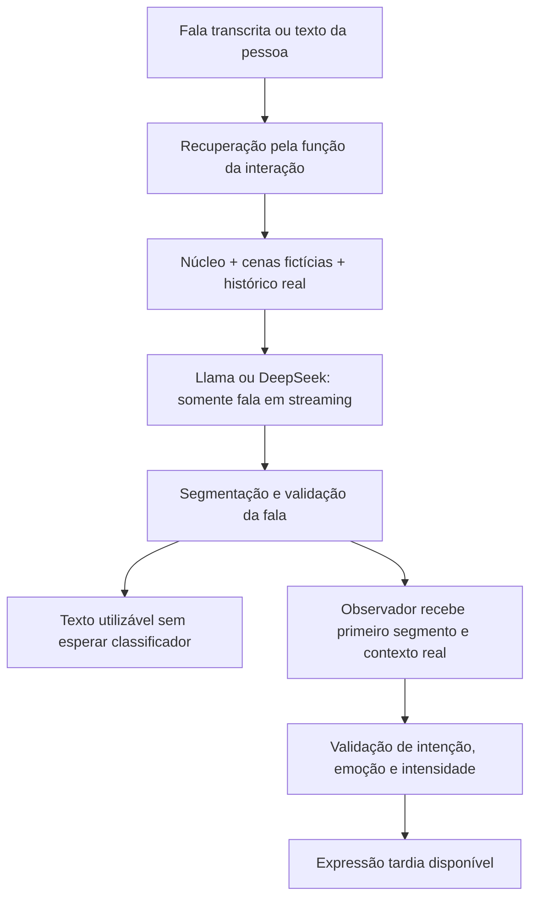

# Fala, referências de atuação e expressão — candidato v8

## O que foi alterado na API

Os exemplos curados permanecem separados da memória pessoal e do conhecimento ficcional. `buildPersonaReferenceContext` agora representa cada exemplo como uma cena independente no contexto de sistema, com identificador, função, situação e diálogo. Eles deixam de aparecer como turnos anteriores da pessoa. O histórico real continua sendo construído exclusivamente das mensagens persistidas da conversa.

A recuperação semântica indexa e reordena os exemplos pela situação e direção curadas. As falas e acontecimentos da cena não entram no vetor de busca. Não há reconhecimento por palavras específicas, lista de nomes ou regras particulares para português. A busca continua usando embeddings e, quando configurado, reranker local.

O índice usa o namespace `:persona-functions-v2`: vetores antigos baseados nas falas não podem ser reutilizados silenciosamente. Para preparar o índice local, na pasta `code/backend/api`, execute:

```powershell
npm run persona:references -- index
```

Reinicie a API depois da indexação. A inicialização carrega e aquece o índice; não faz a indexação completa automaticamente. Se o índice novo estiver ausente, a recuperação informa `unindexed` e segue sem exemplos. A fronteira estrutural evita confundir fontes no código, mas o modelo ainda pode extrapolar: isso precisa de avaliação do texto.

## Caminho experimental sem cabeçalho



`createParallelExpressionSpeech` e `observedSpeech` implementam esse candidato. A promessa do classificador não é aguardada antes de entregar o segmento. A expressão começa neutra, com metadados não confirmados; uma proposta válida pode chegar depois. Falha ou cancelamento do observador não bloqueia a fala. Uma interrupção cancela sua classificação, e nenhum resultado pode alterar áudio que já passou.

O observador desta avaliação é o DeepSeek, com temperatura zero e resposta JSON. Ele classifica a atuação textual da **persona**, não a emoção da pessoa nem a qualidade da resposta. Também não é o Jev, que permanece juiz apenas na avaliação. O observador vê o primeiro segmento, não necessariamente a resposta completa; alterações emocionais posteriores podem exigir outra política de atualização.

O contrato aceita 39 intenções, 50 emoções e intensidade contínua de zero a um. Validade do contrato significa que a proposta pode ser representada; não significa que a emoção escolhida está correta, que corresponde ao cânone ou que a voz executou essa emoção. Os presets vocais e visuais disponíveis não se multiplicam automaticamente com os rótulos.

## Fronteira de implantação

A separação de exemplos foi aplicada à recuperação da API. O caminho sem cabeçalho é um candidato executável de aplicação e avaliação, **ainda não substitui o processador da chamada no Voice Test**. As medições desta rodada não representam a latência completa da API, STT, TTS ou reprodução.

O candidato recusa qualquer `factCount` diferente de zero. Não deve ganhar velocidade removendo a conferência de fatos persistentes. Para integrar conversas com memória, será necessário preservar seleção e permissões de fontes e explicitar o uso factual sem reintroduzir uma espera de expressão antes da fala. A validação textual dos metadados antecede a integração vocal; o usuário avalia voz por último.

Os testes locais cobrem entrega do texto com classificador pendente, cancelamento, erro do observador, preservação da intensidade máxima, fronteira da memória, indexação versionada e ausência de demonstrações no histórico real.

## Avaliação e orçamento

Na pasta da API:

```powershell
npm run eval:latency-v8
npm run eval:jev-v8
npm run report:jev-v8
npm run report:latency-v8
```

Os dois primeiros comandos apenas apresentam o plano quando não recebem `--run`; esse parâmetro realiza chamadas pagas. Os relatórios são locais. A rodada existente é congelada e não deve ser sobrescrita nem receber renovação automática de orçamento. O teto restante herdado é US$ 0,137070884, somado aos US$ 0,132929116 já consumidos na etapa de US$ 0,27. Cada chamada do juiz recebe uma reserva conservadora antes do envio; seu custo informado é reconciliado antes da próxima. A execução para se a reserva seguinte não couber no saldo.

Uma falha local de substituição do arquivo do orçamento interrompeu uma tentativa parcial. O gravador recebeu serialização e repetição limitada da **operação local de arquivo**, sem repetir pedidos remotos. A retomada conserva manifesto, prompts, modelos, rotas e amostragem, registra separadamente a revisão de orquestração e exclui a tentativa parcial das comparações. Chamadas sem custo confirmado conservam sua reserva máxima no teto agregado.
